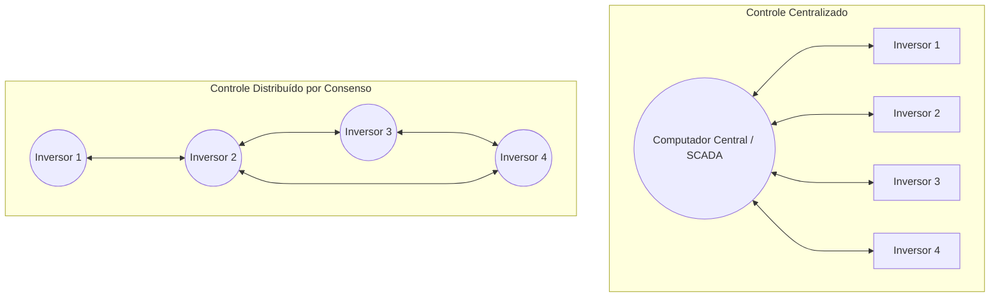
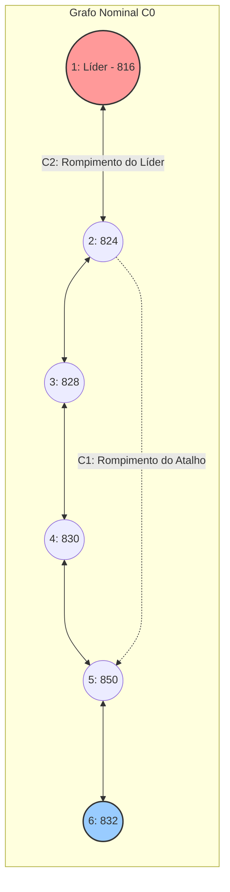

# TCC Facens: Controle Distribuído de Tensão sob Falhas de Comunicação

Impacto de falhas na camada de comunicação no consenso proporcional para corte de geração fotovoltaica (*fair power curtailment*) no alimentador IEEE 34 barras: comparação entre as arquiteturas **Leader-Follower** e **Leaderless**.

---

## Tópico 0: Briefing para Iniciantes — Como Rodar e Entender o Projeto

Se você está tendo o primeiro contato com o projeto, com Python ou com simulações de redes elétricas, esta seção foi feita sob medida para ambientar seu fluxo de trabalho de forma simples e direta.

### 0.1 O que é o projeto em uma frase?
Este projeto investiga se algoritmos de controle distribuído (onde vários geradores solares conversam entre si para manter a tensão da rede elétrica dentro do limite seguro de $1{,}05\text{ pu}$) continuam funcionando quando ocorrem panes, rompimentos de cabos de rede ou perda temporária de comunicação entre eles.

### 0.2 O que é o `uv` e por que usamos?
No mundo Python tradicional, configurar ambientes virtuais (`venv`), versões de Python e bibliotecas (`pip install`) costuma causar conflitos de versão entre computadores. 

Para resolver isso, este projeto utiliza o **`uv`**, uma ferramenta moderna desenvolvida em Rust pela Astral:
* **Gerenciamento de Python:** O projeto requer Python 3.13 ou superior. O `uv` pode usar uma instalação existente ou baixar/gerenciar uma versão compatível, conforme a configuração do ambiente.
* **Isolamento Total:** Cria um ambiente virtual em sandbox sem poluir as configurações globais do seu computador.
* **Reprodutibilidade:** Garante que qualquer membro da equipe execute o código com exatamente as mesmas versões de bibliotecas registradas no arquivo `uv.lock`.

### 0.3 Instalação do `uv` (Passo a Passo)

#### No Windows (PowerShell):
Abra o PowerShell (não precisa ser como Administrador) e execute:
```powershell
powershell -ExecutionPolicy ByPass -c "irm https://astral.sh/uv/install.ps1 | iex"
```

#### No Linux / macOS:
```bash
curl -LsSf https://astral.sh/uv/install.sh | sh
```

Após instalar, feche e reabra o terminal. Digite `uv --version` para verificar se o comando está disponível.

### 0.4 Clonando o Repositório e Executando a Simulação

#### O que é o `git clone`?
O comando `git clone` faz o download de uma cópia exata de todos os arquivos, códigos, dados e histórico de versões do projeto hospedado no GitHub diretamente para o seu computador.

> **Pré-requisito (Git instalado):**
> Para verificar se você já tem o Git instalado, digite no terminal: `git --version`.  
> Caso não tenha, você pode instalá-lo no Windows executando no PowerShell:
> ```powershell
> winget install --id Git.Git -e --source winget
> ```
> ou baixando o instalador em [git-scm.com](https://git-scm.com/).

#### Passo a Passo Completo:

```powershell
# 1. Baixe uma cópia do repositório para o seu computador
git clone https://github.com/jpseraphimrodrigues/TCC_Facens_Smart_GRID.git

# 2. Entre na pasta do projeto que acabou de ser clonada
cd TCC_Facens_Smart_GRID

# 3. Sincronize as dependências e o ambiente virtual com o uv
#    (O uv sincroniza as dependências e pode gerenciar uma versão compatível do Python)
uv sync

# 4. Execute a simulação completa (2 arquiteturas x cenários C0 a C3)
uv run python Experimento_Consenso_comunication_failure.py
```

### Configuração atual do experimento probabilístico

O projeto possui dois modos complementares, e os dois seguem a mesma estrutura
de três camadas: (1) **sem controle** (baseline sem consenso), (2) **com
controle, sem perdas de comunicação** e (3) **com controle, com cenários de
perda de comunicação**. O que muda entre os modos é como a camada 3 é
construída:

* No **baseline determinístico**, a camada 3 é a remoção estrutural de
  enlaces ou o isolamento temporário de agentes (cenários `C1`, `C2`,
  `C3_*`). A camada 2 é o cenário `C0` (grafo nominal, sem falha).
* No **modo probabilístico** (`--enable-channel`), a topologia permanece
  sempre a nominal — a falha não é mais estrutural, é a perda/atraso de
  mensagens individuais. A camada 2 é `C0` com o canal ativo e perda `0.00`
  (controle "com canal, mas sem perdas"), e a camada 3 é um cenário
  `C0_perda_<p>` por cada probabilidade de perda testada.

Isso evita conflacionar os dois eixos: uma execução com `--enable-channel`
nunca aplica perda probabilística sobre `C1`/`C2`/`C3` — esses continuam
sendo o eixo estrutural determinístico, executados sem canal.

1. **Canal probabilístico:** use `--enable-channel` com `--loss-probability`
   (uma probabilidade, ou várias separadas por vírgula, ex.:
   `--loss-probability 0.05,0.1,0.2`), `--delay-steps` e `--seed`. O valor
   `0.0` é sempre incluído automaticamente como o cenário de controle `C0`;
   cada valor adicional gera um cenário `C0_perda_<p>` próprio. Salve esses
   resultados em uma pasta separada do baseline para que os experimentos
   possam ser comparados.

2. **A equação de atualização anterior precisa de uma ressalva de sinal.** O
   código usa `rho` como fração cortada e soma o termo de correção:

   ```text
   rho(k+1) = clip((I - epsilon L)rho(k) + c(k), 0, 1)
   ```

   A variável `rho` representa a fração de corte; portanto, sobretensão aumenta
   `rho` e o termo corretivo aparece com sinal positivo.

3. **Resultados:** as figuras em `Resultados/FASE0_EXP001` correspondem ao
   baseline determinístico. Uma execução probabilística gera evidência própria,
   incluindo `raw/channel_messages.csv`, e deve ser identificada por sua pasta,
   semente e parâmetros do canal.

4. **“Comunicação ideal” (`C0`) tem o mesmo significado nos dois modos: com
   controle, sem perda.** No baseline determinístico, `C0` é o grafo nominal
   sem remoção de enlace, executado sem canal. No modo probabilístico, `C0`
   é o mesmo grafo nominal, mas executado *através* do canal com perda
   `0.00` — isso valida que o canal não introduz viés quando não há perda.
   Uma execução com perda de 5% nunca é rotulada `C0`; ela aparece como o
   cenário `C0_perda_0.05`, distinto do controle.

5. **A afirmação de que o Leaderless “mantém o controle” é condicionada.**
   Ela descreve os resultados registrados para o alimentador, as curvas, os
   ganhos e os cenários deste experimento. Não é uma prova de superioridade
   geral. No modo probabilístico, a conclusão precisa ser baseada em várias
   replicações e no `resumo_estatistico.csv`.

6. **A palavra “perda” nos cenários C1 e C2 é estrutural.** Nesses cenários,
   “perda permanente do enlace” significa que o enlace foi removido da
   topologia durante o dia. Não significa que exatamente uma porcentagem de
   pacotes foi perdida. A porcentagem de pacotes pertence ao parâmetro
   `--loss-probability` do canal experimental.

7. **O grafo de comunicação não é automaticamente a rede física de
   telecomunicações.** Ele é uma hipótese manual de conectividade entre os
   agentes. O IEEE 34 barras é o modelo elétrico; o grafo dos seis agentes é o
   modelo lógico de comunicação. O README não deve ser interpretado como uma
   validação de uma infraestrutura IEC 61850 real.

8. **O IEEE 34 barras é um alimentador de referência.** Ele não representa uma
   instalação real medida. As curvas `Entradas/curvas_24h.csv` são entradas do
   experimento, não medições de campo.

9. **A árvore do repositório evoluiu.** Além dos itens mostrados na árvore
   original, o estado atual inclui `src/tcc_facens/communication.py`,
   `scripts/run_channel_sweep.py`, `tests/`, `uv.lock` e o entry point
   instalável. O modo probabilístico também cria `raw/channel_messages.csv`,
   enquanto `raw/log_mensagens.csv` continua sendo o log topológico legado.

10. **O `uv` pode instalar o Python, mas isso depende da configuração do
    ambiente.** O comando `uv sync` usa o Python disponível ou um Python que o
    `uv` consiga baixar/gerenciar. A versão exigida pelo projeto é Python 3.13
    ou superior, conforme `pyproject.toml`; em caso de dúvida, confirmar com
    `uv python list` e `uv run python --version`.

11. **O projeto usa snapshots horários, não uma simulação transitória.** O
    atraso em `--delay-steps` é atraso discreto entre iterações do algoritmo de
    consenso dentro do snapshot. Ele não representa automaticamente atraso
    físico em segundos, estabilidade eletromagnética ou dinâmica real de um
    inversor.

12. **A pasta de sweep possui uma estrutura própria.** Depois de executar
    `scripts/run_channel_sweep.py`, os arquivos estatísticos ficam diretamente
    na pasta informada em `--output-dir`, enquanto cada execução individual
    fica em `replicacao_001/`, `replicacao_002/` e assim por diante. Portanto,
    `resumo_estatistico.csv` não fica dentro de `summary/` das replicações.

Para executar o modelo experimental de comunicação com perda probabilística e
atraso, use uma pasta de saída separada para não sobrescrever o baseline. O
exemplo abaixo gera três cenários de perda (`C0_perda_0.05`, `C0_perda_0.10`,
`C0_perda_0.20`) além do controle automático `C0` (perda `0.00`):

```powershell
uv run python Experimento_Consenso_comunication_failure.py `
  --enable-channel `
  --loss-probability 0.05,0.1,0.2 `
  --delay-steps 1 `
  --seed 42 `
  --output-dir Resultados/FASE0_EXP001_CHANNEL
```

O manifesto registra os parâmetros do canal. Os eventos por mensagem ficam em
`raw/channel_messages.csv`; `raw/log_mensagens.csv` continua representando o
log topológico do baseline determinístico.

Para executar várias replicações com sementes consecutivas e gerar o resumo
estatístico, use:

```powershell
uv run python scripts/run_channel_sweep.py `
  --replications 3 `
  --loss-probability 0.05 `
  --delay-steps 1 `
  --output-dir Resultados/SWEEP_001
```

O script preserva cada execução em `replicacao_###/` e gera
`replicacoes_brutas.csv` e `resumo_estatistico.csv`.

### 0.5 Onde encontrar os resultados gerados?
Após o término da execução, todos os resultados ficam organizados na pasta `Resultados/FASE0_EXP001/`:
* **Gráficos em alta resolução:** `Resultados/FASE0_EXP001/figures/` (curvas de tensão, iterações, gráficos de convergência e mapas de calor).
* **Tabelas consolidadas (CSV):** `Resultados/FASE0_EXP001/summary/` (convergência, dispersão de corte $\sigma_r$, violações de tensão).
* **Metadados e validações:** `Resultados/FASE0_EXP001/manifest.json` (hashes de integridade e checagens elétricas automáticas).

### 0.6 Guia didático do modo de comunicação probabilístico

O comando básico executa o **baseline determinístico**. Nesse modo, os cenários C1, C2 e C3 representam alterações conhecidas na topologia: um enlace é removido ou um agente é isolado durante uma janela definida. Esse baseline é importante porque permite observar o efeito causal de uma falha controlada.

O modo `--enable-channel` acrescenta uma segunda camada: mesmo quando existe um enlace disponível, cada mensagem pode ser perdida e pode chegar depois de algumas iterações. Essa distinção é fundamental:

* **Falha topológica:** o enlace não existe ou está indisponível; todas as mensagens daquele enlace falham.
* **Perda probabilística:** o enlace existe, mas uma transmissão específica pode falhar.
* **Atraso:** a mensagem foi aceita pelo canal, mas só fica disponível ao receptor posteriormente.

O modo probabilístico deve ser executado em outra pasta, pois ele representa uma pergunta experimental diferente do baseline.

#### O que é uma mensagem de comunicação?

Neste projeto, uma mensagem é um pequeno pacote de informação enviado por um agente para um vizinho. Ela contém, principalmente, o estado de curtailment que será usado no consenso. Uma mensagem pode ser imaginada assim:

```text
origem: agente 2
destino: agente 3
conteúdo: rho = 0,20
passo de envio: k = 10
passo de entrega: k = 11
estado: entregue
```

O arquivo `src/tcc_facens/communication.py` implementa essa camada por meio de dois objetos principais:

* **`Message`:** representa uma mensagem individual, identificando origem, destino, conteúdo, instante de envio e instante previsto de entrega.
* **`CommunicationChannel`:** representa o canal entre agentes. Ele decide se a mensagem será perdida, coloca mensagens aceitas em uma fila, entrega as mensagens cujo atraso terminou, guarda a última mensagem válida de cada par origem-destino e contabiliza tentativas, entregas, perdas e mensagens pendentes.

O canal foi criado para que a simulação não trate “comunicação” apenas como uma matriz estática. Ele permite testar o que acontece quando o controlador não recebe uma atualização nova. A política implementada é manter a última mensagem válida; antes da primeira entrega, o consenso usa o estado atual como inicialização.

#### Por que usar uma camada de canal?

Sem uma camada de canal, o código saberia somente se uma aresta está ligada ou desligada. Isso modela conectividade, mas não modela a mensagem em si. Com o canal, podemos distinguir:

1. o agente publicou uma informação;
2. o canal perdeu ou aceitou a mensagem;
3. a mensagem ficou aguardando na fila;
4. o receptor recebeu a informação;
5. o controlador continuou usando uma informação antiga enquanto esperava uma nova.

Essa separação torna possível investigar perdas, atrasos, obsolescência da informação e recuperação depois de uma falha.

#### O que é `rho` e por que ele aparece nas mensagens?

`rho` é a **fração de curtailment** de um agente, isto é, a porcentagem da potência fotovoltaica disponível que será cortada:

$$
\rho_i = \frac{P_{\mathrm{cortada},i}}{P_{\mathrm{disponível},i}},
\qquad 0 \leq \rho_i \leq 1.
$$

Por exemplo, se `rho = 0,20`, o agente corta aproximadamente 20% da potência que poderia gerar. Se `rho = 0`, não há corte; se `rho = 1`, toda a geração disponível é cortada.

O `rho` é enviado porque ele é a variável que os agentes precisam compartilhar para alcançar o curtailment proporcional. A falha não é implementada “no rho” diretamente. A falha ocorre no caminho da mensagem que transporta o `rho`: quando uma mensagem é perdida ou atrasada, o vizinho não recebe o novo valor e usa a última informação disponível. Assim, o estado local de cada agente pode divergir temporariamente dos demais.

Essa diferença é importante: o canal não altera artificialmente o valor de `rho`; ele altera quais valores cada agente consegue observar.

#### Explicação dos parâmetros do canal

O exemplo abaixo habilita o canal probabilístico:

```powershell
uv run python Experimento_Consenso_comunication_failure.py `
  --enable-channel `
  --loss-probability 0.05 `
  --delay-steps 1 `
  --seed 42 `
  --output-dir Resultados/FASE0_EXP001_CHANNEL
```

Cada argumento tem uma função específica:

| Parâmetro | O que significa | Valores aceitos | Efeito do exemplo |
|---|---|---|---|
| `--enable-channel` | Liga o modelo probabilístico de mensagens. | Não recebe valor; presente ou ausente. | O canal é usado no consenso. |
| `--loss-probability` | Probabilidade(s) de uma transmissão ser perdida. | Um ou mais números reais entre `0` e `1`, separados por vírgula. | `0.05,0.1,0.2` cria três cenários `C0_perda_*`, além do controle `C0` (perda `0.00`, sempre incluído). |
| `--delay-steps` | Quantidade inteira de iterações até a entrega. | Inteiro maior ou igual a `0`. | `1` significa que uma mensagem enviada em `k` pode ser usada em `k+1`. |
| `--seed` | Semente do gerador pseudoaleatório. | Inteiro; também pode ser omitido. | `42` permite repetir a mesma sequência de perdas. |
| `--output-dir` | Pasta para os resultados da execução. | Caminho válido. | Evita sobrescrever o baseline. |

Valores típicos:

* `--loss-probability 0`: nenhuma perda aleatória; equivalente ao cenário de controle `C0` (que já roda automaticamente).
* `--loss-probability 0.05`: um único cenário adicional, `C0_perda_0.05`.
* `--loss-probability 0.05,0.1,0.2`: três cenários de perda na mesma execução, comparáveis ao mesmo controle `C0`.
* `--loss-probability 1`: todas as transmissões são perdidas; é um teste extremo.
* `--delay-steps 0`: entrega imediata dentro do ciclo.
* `--delay-steps 1`: uma iteração de atraso.
* `--delay-steps 10`: atraso prolongado, útil para análise de informação obsoleta.
* `--seed 42`: execução reproduzível.
* ausência de `--seed`: o Python escolhe uma sequência não fixada; duas execuções podem produzir resultados diferentes.

`--loss-probability` não aceita valores negativos nem maiores que `1`. `--delay-steps` não aceita valores negativos. O programa interrompe a execução com uma mensagem de erro quando esses limites são violados.

#### O que é uma seed (semente)?

O canal usa números pseudoaleatórios para decidir se cada mensagem será perdida. “Pseudoaleatório” significa que os números parecem aleatórios, mas são produzidos por um algoritmo determinístico. A **seed** é o valor inicial desse algoritmo.

Com a mesma configuração e a mesma seed, a sequência de decisões tende a ser a mesma:

```text
seed 42 + perda 5%  -> mensagem 1 entregue, mensagem 2 perdida, ...
seed 42 + perda 5%  -> mesma sequência novamente
seed 43 + perda 5%  -> outra sequência de perdas
```

A seed não reduz a aleatoriedade do modelo; ela torna a realização específica auditável e repetível. Por isso ela deve ser registrada no `manifest.json` junto com a taxa de perda e o atraso.

#### Por que usar uma abordagem estatística?

Uma única execução com uma única seed mostra apenas uma realização possível do canal. Ela pode ter, por acaso, mais ou menos perdas que a média esperada. Para avaliar o comportamento típico, executamos o mesmo cenário várias vezes com seeds diferentes.

O script `scripts/run_channel_sweep.py` faz isso. Com `--replications 30`, por exemplo, ele executa 30 realizações independentes, preserva cada pasta `replicacao_###/` e calcula:

* **contagem:** quantas execuções contribuíram para a métrica;
* **média:** comportamento médio das replicações;
* **desvio-padrão:** quanto os resultados variam entre seeds;
* **mínimo e máximo:** faixa observada nas execuções.

A abordagem estatística é necessária porque “5% de perda” é uma probabilidade por tentativa, não a promessa de exatamente 5% em toda execução curta. Com mais replicações, estimamos melhor a distribuição de resultados e podemos responder perguntas como:

* em quantas execuções houve violação de tensão?
* qual é o número médio de iterações?
* qual arquitetura apresenta menor dispersão de curtailment?
* quão sensível é o resultado ao atraso e à taxa de perda?

As replicações não substituem o baseline determinístico. O baseline explica o efeito estrutural da topologia; as replicações medem a variabilidade introduzida pelo canal probabilístico.

Exemplo de varredura estatística:

```powershell
uv run python scripts/run_channel_sweep.py `
  --replications 30 `
  --loss-probability 0.05 `
  --delay-steps 1 `
  --seed 42 `
  --output-dir Resultados/SWEEP_005PCT_1STEP
```

Nesse caso, a primeira execução usa a seed `42`, a segunda usa `43` e assim por diante. O resumo estatístico não deve ser interpretado como prova universal para qualquer rede: ele descreve a distribuição observada sob os parâmetros, curvas, alimentador, topologia e política de memória escolhidos.

#### Quais arquivos comprovam o comportamento do canal?

No modo probabilístico, os principais artefatos são:

* `manifest.json`: informa se o canal estava habilitado, a probabilidade de perda, o atraso e a seed;
* `raw/channel_messages.csv`: uma linha por tentativa, com origem, destino, passo de envio, passo de entrega e estado (`delivered`, `lost` ou `queued`);
* `raw/timestep.csv`: inclui os contadores agregados de mensagens tentadas, entregues, perdidas e pendentes por hora;
* `tables/resumo_completo.csv`: reúne as métricas elétricas e de curtailment;
* `resumo_estatistico.csv`: resume as replicações quando é usado o script de varredura.

O arquivo `raw/log_mensagens.csv` continua sendo o registro do modelo topológico determinístico. Ele deve ser analisado separadamente do `channel_messages.csv`, pois os dois respondem a perguntas diferentes.

---

## 1. Fundamentos Elétricos: Fluxo de Potência, AltDSS e o IEEE 34 Barras

### 1.1 O que é Fluxo de Potência (*Power Flow*)?
O fluxo de potência (ou cálculo de fluxo de carga) é o cálculo em regime permanente que determina as grandezas elétricas de toda a rede:
* Módulos de tensão ($|V_i|$) e ângulos de fase ($\theta_i$) em cada barra;
* Fluxos de potência ativa ($P$) e reativa ($Q$) em linhas de distribuição e transformadores;
* Perdas elétricas técnicas do sistema.

Matematicamente, ele resolve o sistema não-linear de balanço de potência nodal:
$$P_i = \sum_{j=1}^{N} |V_i| |V_j| \big( G_{ij}\cos(\theta_i - \theta_j) + B_{ij}\sin(\theta_i - \theta_j) \big)$$
$$Q_i = \sum_{j=1}^{N} |V_i| |V_j| \big( G_{ij}\sin(\theta_i - \theta_j) - B_{ij}\cos(\theta_i - \theta_j) \big)$$
onde $Y_{bus} = G + jB$ é a matriz de admitância nodal. Em sistemas de distribuição desequilibrados, o cálculo é resolvido iterativamente em múltiplos passos no tempo (*snapshots* horários via `SolveSnap()`).

### 1.2 O que são o OpenDSS e o AltDSS?
* **OpenDSS (EPRI):** O *Open Distribution System Simulator* é o simulador de referência internacional desenvolvido pelo Electric Power Research Institute para estudos de redes de distribuição com integração de recursos energéticos distribuídos (DERs).
* **AltDSS (`altdss`):** É a interface Python de alta performance desenvolvida pela iniciativa *DSS-Extensions*. Em vez de usar a interface COM lenta e proprietária do Windows, o AltDSS acessa a biblioteca compilada em C/C++ diretamente na memória RAM, permitindo execuções dezenas de vezes mais rápidas, manipulação de objetos pythônicos nativos e portabilidade entre sistemas operacionais.

### 1.3 O Alimentador IEEE 34 Barras e o Desafio da GD Solar
O alimentador IEEE 34 nós representa uma rede de distribuição rural típica, real e desafiadora:
* **Extensão:** Rede longa (~90 km de extensão), com nível de tensão de $24{,}9\text{ kV}$;
* **Topologia:** Tronco principal trifásico com extensos ramais laterais monofásicos;
* **Impedância Elevada:** Relação $R/X$ alta e linhas compridas geram quedas de tensão significativas.

```
Subestação (69/24.9 kV)
    │
   [800] ─── [814] ─── [850] ─── [816 (PV2-Líder)] ─── [824 (PV1)] ─── ... ─── [832 (PV6)]
```

#### O Problema da Sobretensão por Fluxo Reverso
Pela aproximação linear de queda de tensão em redes radiais:
$$\Delta V \approx \frac{R \cdot P + X \cdot Q}{V_{\text{nom}}}$$
Durante os horários de pico solar (10h às 14h), a geração dos inversores fotovoltaicos supera o consumo local das cargas. A injeção líquida de potência ativa ($P < 0$) inverte o fluxo de potência, causando uma **elevação de tensão** nas barras distantes da subestação que frequentemente ultrapassa o limite normativo superior de **$1{,}05\text{ pu}$** (conforme PRODIST Módulo 8 / IEEE 1547).

Para evitar desligamento forçado ou danos a equipamentos, os inversores realizam o **corte de geração ativa (*power curtailment*)**, reduzindo sua potência de forma coordenada.

---

## 2. Algoritmos de Consenso Distribuído

### 2.1 O que é Consenso Distribuído?
Em sistemas de controle centralizado (ex.: SCADA tradicional), todos os geradores enviam dados para um computador central que processa os comandos e devolve os *setpoints*. Se o computador central ou o link de dados dele cair, o controle inteiro colapsa (*ponto único de falha*).

No **controle distribuído baseado em consenso**, não existe computador central. Cada inversor fotovoltaico possui inteligência local e conversa **apenas com seus vizinhos imediatos** por um canal de comunicação. Através de trocas sucessivas de mensagens, todos chegam a um acordo comum sobre a intensidade da intervenção necessária na rede.



### 2.2 Tipos de Consenso e a Necessidade do Critério Proporcional

#### Consenso Absoluto vs. Consenso Proporcional
* **Consenso Absoluto ($p_i^{\text{inj}}$ em kW):** Todos os agentes convergem para cortar o mesmo montante absoluto de potência ativa em kW. **Problema:** Um inversor pequeno de 10 kVA teria 100% de sua geração cortada se o comando médio fosse 10 kW, enquanto um inversor de 150 kVA perderia menos de 7%.
* **Consenso Proporcional ($\rho_i \in [0, 1]$):** Todos os agentes convergem para a mesma **fração percentual de corte** em relação à sua capacidade disponível:
  $$\rho_i = \frac{P_{\text{curt},i}}{P_{\text{disp},i}}$$
  Isso garante equidade e justiça regulatória (*fairness*): todos os proprietários dividem o ônus do controle proporcionalmente à sua capacidade instalada.

#### Leader-Follower vs. Leaderless
1. **Leader-Follower (LF):** Um agente específico é eleito líder (aqui definido pela barra com maior violação acumulada $S_i$). O líder mede o erro de tensão da rede em relação a $1{,}05\text{ pu}$ e calcula um termo corretivo global; os seguidores apenas misturam seus estados $\rho_j$ com os vizinhos até igualarem o líder.
2. **Leaderless (Sem Líder):** Todos os agentes medem a tensão de sua própria barra local e calculam sua própria correção se houver sobretensão local ($V_i > 1{,}05\text{ pu}$). A homogeneização do corte entre barras com e sem sobretensão ocorre pela difusão do consenso.

---

### 2.3 Formulação Matemática do Consenso no Projeto

A malha de comunicação entre os $N=6$ geradores é descrita por um grafo não-direcionado $\mathcal{G} = (\mathcal{V}, \mathcal{E})$, caracterizado por:
* **Matriz de Adjacência $A = [a_{ij}]$:** $a_{ij} = 1$ se os agentes $i$ e $j$ comunicam entre si, e $0$ caso contrário;
* **Matriz de Graus $D = \operatorname{diag}(d_i)$:** onde $d_i = \sum_{j} a_{ij}$ é o número de conexões do agente $i$;
* **Matriz Laplaciana $L = D - A$:** define o operador de difusão na rede.

A conectividade algébrica $\lambda_2(L)$ (segundo menor autovalor de $L$, conhecido como autovalor de Fiedler) governa a conectividade estrutural:
$$\lambda_2(L) > 0 \iff \text{Grafo Conexo (consenso possível)}$$
$$\lambda_2(L) = 0 \iff \text{Grafo Particionado (desconexo)}$$

#### Equação de Atualização de Estado
A cada iteração de controle $k$, cada agente atualiza sua fração de curtailment $\rho_i(k)$ segundo:
$$\rho_i(k+1) = \operatorname{clip}\left( \rho_i(k) + \varepsilon \sum_{j \in \mathcal{N}_i} a_{ij}(k) \big[\rho_j(k) - \rho_i(k)\big] + c_i(k),\, 0,\, 1 \right)$$
com a potência ativa cortada dada por:
$$P_{\text{curt},i}(k) = \rho_i(k) \cdot P_{\text{disp},i}(k)$$

#### Passo de Convergência $\varepsilon$
Calculado a partir do traço da Laplaciana nominal $L_0$:
$$\varepsilon = \frac{2}{\sum_{i=1}^N d_i(A_0)} = \frac{2}{\operatorname{tr}(L_0)}$$

#### Termo de Correção de Tensão $c_i(k)$
Esta é a **única linha de código** que difere conceitualmente as duas arquiteturas:
* **No Leader-Follower:**
  $$c_i(k) = \mathbb{1}_{i = \text{líder}} \cdot \beta \max\big(0,\; V_{\max-\text{mon}}(k) - V_{\text{lim}}\big)$$
* **No Leaderless:**
  $$c_i(k) = \beta \max\big(0,\; V_i(k) - V_{\text{lim}}\big)$$
onde $\beta = 5{,}0$ é o ganho proporcional de correção e $V_{\text{lim}} = 1{,}05\text{ pu}$.

#### Critério de Parada
O laço de iterações $k$ para quando a tensão mais alta atinge a faixa admissível:
$$V_{\max-\text{mon}}(k) \le 1{,}0500\text{ pu} + \text{tol} \quad (\text{com } \text{tol} = 5 \times 10^{-4}\text{ pu}) \quad \text{ou} \quad k = k_{\max} = 500$$

---

## 3. Configuração dos Agentes Fotovoltaicos na Rede IEEE 34

Foram instalados 6 geradores fotovoltaicos (GFVs) distribuídos ao longo do alimentador, cujas posições no grafo de comunicação foram ordenadas a partir da caracterização prévia do perfil de sobretensões sem controle:

| Posição no Grafo | Agente PV | Barra | Potência Nominal ($S_n$) | Sobretensão Acumulada ($S_i$) | Papel no Experimento |
| :---: | :---: | :---: | :---: | :---: | :---: |
| **1** | PV2 | **816** | 125 kVA | $0{,}0720\text{ pu}\cdot\text{h}$ | **Líder Eleito ($\arg\max S_i$)** |
| **2** | PV1 | **824** | 150 kVA | $0{,}0697\text{ pu}\cdot\text{h}$ | Subestação / Tronco trifásico |
| **3** | PV3 | **828** | 100 kVA | $0{,}0691\text{ pu}\cdot\text{h}$ | Trecho intermediário |
| **4** | PV4 | **830** | 130 kVA | $0{,}0493\text{ pu}\cdot\text{h}$ | Trecho intermediário |
| **5** | PV5 | **850** | 90 kVA | $0{,}0720\text{ pu}\cdot\text{h}$ | Ramal intermediário de baixa impedância |
| **6** | PV6 | **832** | 115 kVA | $0{,}0173\text{ pu}\cdot\text{h}$ | **Agente de Contraste ($\arg\min S_i$)** |


---

## 4. Hipóteses Científicas e Cenários de Falha de Comunicação

Para que o leitor compreenda a razão de cada cenário simulado, esta seção formaliza as **hipóteses científicas (H1 a H5)** investigadas no projeto e mapeia cada uma delas para as falhas testadas na rede.

---

### 4.1 O Quadro Teórico de Hipóteses (H1 a H5)

```text
H1 (Sanidade do Modelo)
   └─ Degradação de enlaces aumenta tempo (N_iter) e erro residual.

H2 (Justiça / Fairness)
   └─ Falhas distorcem a distribuição de corte (aumentam a dispersão sigma_r).

H3 (Margem de Tolerância Física — Núcleo Científico)
   └─ Erro de consenso elevado NÃO implica necessariamente violação de tensão (V_max <= 1,05 pu).

H4 e H4′ (Propriedades Estruturais do Grafo)
   └─ H4: Particionamento (lambda_2 = 0) bifurca o sistema em equilíbrios múltiplos.
   └─ H4′: Conectividade conjunta no tempo restaura o consenso após falhas temporárias (C3).

H5 e H5a (Sensibilidade à Arquitetura — Leader-Follower vs. Leaderless)
   └─ H5: No particionamento, LF fica "cego" na partição sem líder; Leaderless mantém regulação local.
   └─ H5a: A falha do próprio líder é o pior caso estrutural de LF, mas neutra em Leaderless.
```

#### • Hipótese H1: Degradação Estrutural Aumenta o Esforço e Erro de Convergência
* **Fundamento:** Em teoria de controle em grafos, a velocidade assintótica de convergência do consenso é proporcional à conectividade algébrica $\lambda_2(L)$ (autovalor de Fiedler).
* **Predição:** À medida que a severidade da falha aumenta ($C_0 \prec C_1 \prec C_3$), o número de iterações necessárias ($N_{\text{iter}}$) para alcançar a estabilização e o erro residual $e_c^\infty$ crescem monotonicamente.
* **Papel no TCC:** Verificação de sanidade do simulador de comunicação (se a falha não aumentasse o esforço, o modelo estaria incorreto).

#### • Hipótese H2: Falhas Distorcem a Distribuição Justa de Curtailment (*Fairness*)
* **Fundamento:** A métrica de dispersão mede o desvio padrão da fração de corte entre os agentes:
  $$\sigma_r(k) = \sqrt{\frac{1}{N}\sum_{i=1}^N \big(\rho_i(k) - \bar{\rho}(k)\big)^2}$$
* **Predição:** Em comunicação ideal ($C_0$), $\sigma_r \approx 0$ (todos cortam rigorosamente a mesma porcentagem de sua capacidade). Sob falha de enlaces, a informação não se distribui igualmente, aumentando $\sigma_r$.
* **Efeito Crítico em Redes Particionadas:** Em grafos desconexos, cada grupo pode convergir internamente para um consenso local (erro local baixo), porém com dispersão global $\sigma_r$ extremamente elevada entre as partições.

#### • Hipótese H3: Degradação do Consenso Não Implica Violação Elétrica Imediata
* **Fundamento:** A rede física de distribuição possui atenuações de impedância e folga operativa até o teto normativo de $1{,}05\text{ pu}$.
* **Predição:** Existe uma **margem física de tolerância** onde o consenso degrada substancialmente ($\sigma_r \gg \sigma_r(C_0)$), mas a tensão máxima ainda permanece contida dentro da faixa regulatória ($V_{\max} \le 1{,}05\text{ pu}$).
* **Papel no TCC:** É a hipótese mais relevante para as distribuidoras de energia: ela delimita até onde uma falha de telecomunicações é tolerável antes de desligar inversores ou queimar equipamentos por sobretensão.

#### • Hipótese H4: Particionamento Produz Equilíbrios Múltiplos ($\lambda_2 = 0$)
* **Fundamento (Teoria Espectral de Grafos):** Um grafo é conexo se e somente se $\lambda_2(L) > 0$. Sob particionamento estático ($\lambda_2 = 0$), o espaço nulo da Laplaciana ganha dimensão igual ao número de componentes conexas, impedindo a existência de um consenso único global.
* **Sub-hipótese H4′ (Conectividade Conjunta no Tempo):** Apoiada na teoria de sistemas dinâmicos chaveados (Nojavanzadeh et al., 2022). Se a integral/soma das matrizes de adjacência ao longo do tempo for conexa:
  $$\bigcup_{k} \mathcal{G}(k) \text{ é conexo}$$
  então o sistema recupera a convergência global após a reconexão do agente em falha temporária ($C_3$).

#### • Hipótese H5: A Arquitetura do Controlador Determina a Resiliência ao Particionamento
* **Fundamento:** No **Leader-Follower (LF)**, apenas o nó líder possui o termo corretivo $c_{\text{líder}}(k) = \beta \max(0, V_{\max-\text{mon}} - V_{\text{lim}})$. No **Leaderless**, todos os nós possuem sensores locais de erro $c_i(k) = \beta \max(0, V_i - V_{\text{lim}})$.
* **Predição em $C_2$:** Quando o líder é isolado, a partição dos seguidores em LF não recebe sinal de erro e para de cortar potência, gerando sobretensão permanente na rede. Em Leaderless, ambas as partições continuam regulando com base nas medições locais.
* **Sub-hipótese H5a (Falha do Próprio Líder é o Pior Caso Estrutural do LF):**
  * No LF, isolar o líder ($m = \text{líder}$) desliga a resposta corretiva da rede inteira; isolar um seguidor ($m \ne \text{líder}$) apenas remove um participante secundário da média.
  * No Leaderless, a identidade do nó que falha não possui assimetria estrutural, dependendo apenas da sua posição física no alimentador.

---

### 4.2 Topologia Nominal e Cenários de Falha Simulados

A malha nominal de comunicação $\mathcal{E}_0$ consiste em uma topologia em **linha com atalho** entre os nós 2 e 5:
$$\mathcal{E}_0 = \{(1,2), (2,3), (3,4), (4,5), (5,6), (2,5)\}$$



### Detalhamento dos Cenários e Associação com as Hipóteses

| Cenário | Descrição da Falha | Condição Topológica | Hipótese Testada | O que se espera observar |
| :--- | :--- | :---: | :---: | :--- |
| **C0** | **Comunicação Ideal no baseline** | Conexo ($\lambda_2 = 0{,}6571$) | **Baseline Geral** | Padrão de comparação: convergência suave, $\sigma_r \approx 0$ e $V_{\max} \le 1{,}05\text{ pu}$. No canal probabilístico, use perda 0 e atraso 0 para reproduzir essa condição. |
| **C1** | **Perda Permanente do Atalho $(2,5)$** | Conexo ($\lambda_2 = 0{,}2679$) | **H1 e H2** | O grafo não se parte, mas a perda do atalho aumenta os saltos de comunicação, elevando $N_{\text{iter}}$. |
| **C2** | **Particionamento Permanente $(1,2)$** | **Desconexo** ($\lambda_2 = 0$) | **H4 e H5** | O líder $\{1\}$ fica isolado de $\{2,3,4,5,6\}$. O LF colapsa por falta de liderança; o Leaderless mantém o controle. |
| **C3_lider_curta** | **Líder isolado na hora 10h, volta em $k=20$** | Conjuntamente Conexo | **H4′ e H5a** | O líder desconecta no pico solar e retorna rápido. Avalia se o sistema se recupera assintoticamente. |
| **C3_lider_longa** | **Líder isolado na hora 10h até $k_{\max}=500$** | Desconexo na hora | **H5 e H5a** | Pior cenário para o Leader-Follower: a hora inteira de sobretensão transcorre sem sinal de controle do líder. |
| **C3_naolider_curta** | **Nó 6 (periférico) isolado, volta em $k=20$** | Conjuntamente Conexo | **H4′ e H5a** | Demonstra que a perda transitória de um não-líder gera distúrbio desprezível. |
| **C3_naolider_longa** | **Nó 6 (periférico) isolado até $k_{\max}=500$** | Desconexo na hora | **H5a** | Contraste estrutural direto com a falha longa do líder (evidencia a assimetria do LF frente ao Leaderless). |

> **Canal probabilístico:** a perda estocástica de mensagens é executada com
> `--enable-channel`. A probabilidade de perda é definida por
> `--loss-probability`, o atraso discreto por `--delay-steps` e a repetibilidade
> por `--seed`. Para avaliar variabilidade, use `scripts/run_channel_sweep.py` e
> consulte `resumo_estatistico.csv`.

---

## 5. Topologias de Comunicação

O gráfico a seguir ilustra visualmente as matrizes e grafos de conectividade em cada cenário:


---

## 6. Resultados Simulados e Validação das Hipóteses Científicas

### 6.1 Particionamento da Rede (Hipótese H5 — Cenário C2)
Quando a rede é bipartida permanentemente no enlace $(1, 2)$, o líder fica ilhado no cenário C2:
* **Em Leader-Follower:** A partição dos seguidores fica cega (sem injeção de erro de sobretensão) e o controle falha em regular as barras a jusante, resultando em sobretensão sustentada.
* **Em Leaderless:** Os inversores continuam calculando correções a partir de suas tensões locais. O resultado elétrico deve ser confirmado pelos CSVs da execução; não é uma garantia para qualquer rede ou parâmetro.


### 6.2 Falha do Líder vs. Não-Líder (Hipótese H5a — Cenário C3)
A vulnerabilidade estrutural observada no experimento Leader-Follower decorre da centralização lógica da informação: a falha do nó 1 (líder) tem impacto maior que a perda do nó 6. No Leaderless, a correção é distribuída pelas medições locais, mas o efeito final depende da rede elétrica, dos parâmetros e da execução:


### 6.3 Margem de Tolerância Física da Rede (Hipótese H3)
Mesmo quando falhas parciais degradam a justiça do consenso (elevando a dispersão $\sigma_r$ entre inversores), a tensão máxima do alimentador muitas vezes permanece contida abaixo de $1{,}05\text{ pu}$, demonstrando que a rede elétrica absorve desvios moderados antes que ocorra violação regulatória:


### 6.4 Esforço e Velocidade de Convergência
Comparação do comportamento do número de iterações $N_{\text{iter}}$ e trajetórias de $\rho(k)$:


---

## 7. Estrutura do Repositório

```text
├── Experimento_Consenso_comunication_failure.py  # Código executável principal (AltDSS + Consenso)
├── experimento.md                                # Caderno de formalização matemática e hipóteses
├── pyproject.toml                                # Definição de dependências do uv
├── IEEE34bus/
│   ├── ieee34Mod3ORIGINAL_CBA.dss                # Modelo do alimentador IEEE 34 em OpenDSS
│   └── IEEELineCodes.DSS                         # Parâmetros de impedância de condutores
├── Entradas/
│   └── curvas_24h.csv                            # Curvas diárias de geração solar e carga
└── Resultados/
    └── FASE0_EXP001/
        ├── config.yaml                           # Parâmetros da simulação
        ├── manifest.json                         # Hashes de integridade e checagens elétricas
        ├── raw/                                  # Séries temporais detalhadas
        ├── summary/                              # Métricas resumidas por cenário
        └── figures/                              # Imagens geradas e gráficos de análise
```

