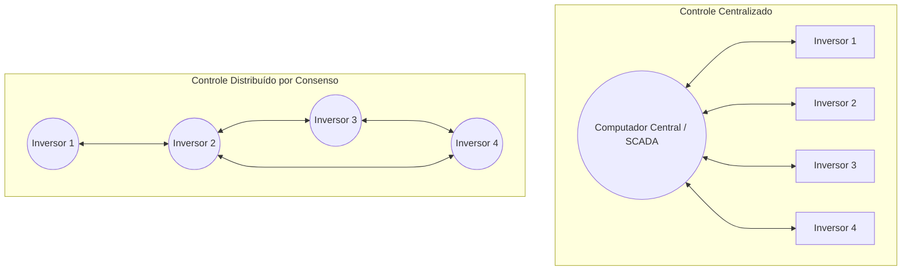
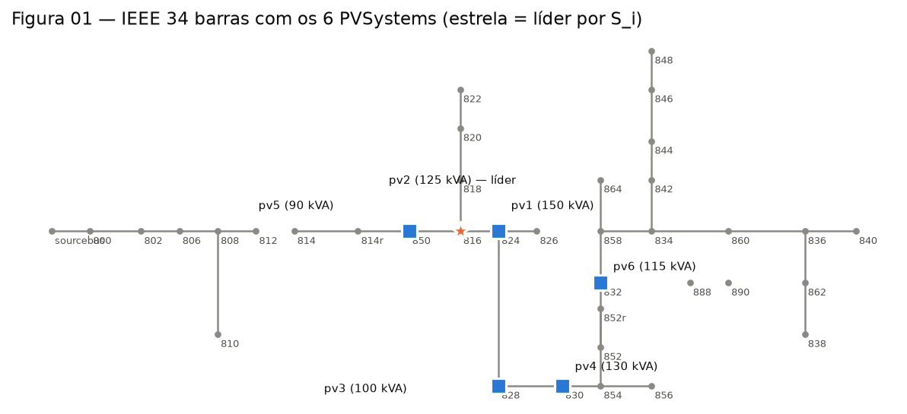
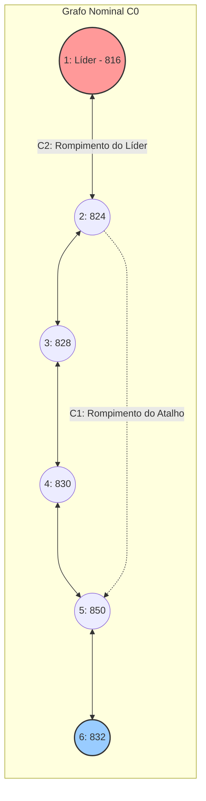
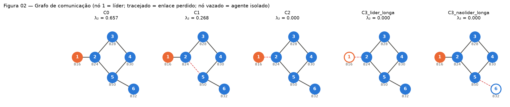
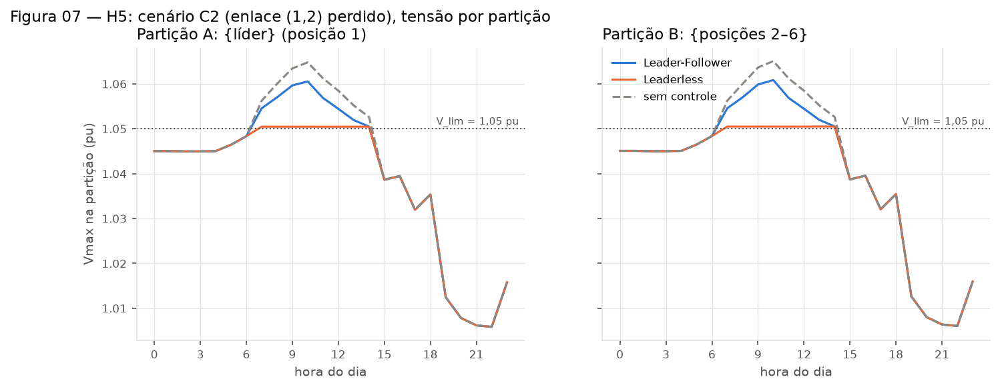
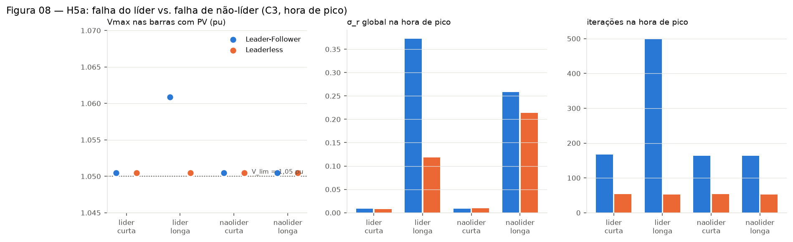
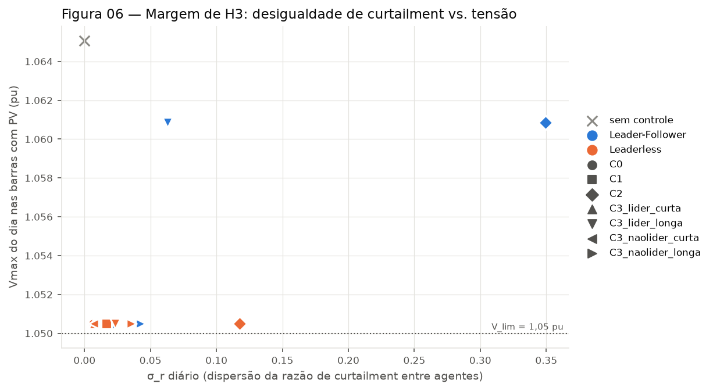
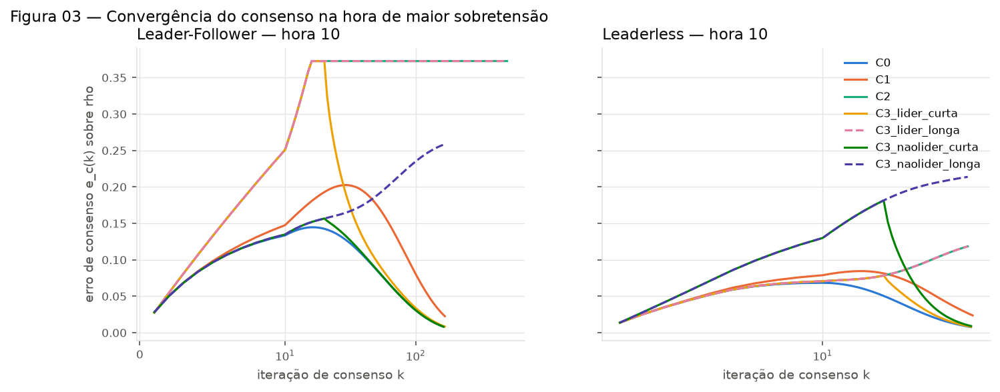

# TCC Facens: Controle Distribuído de Tensão sob Falhas de Comunicação

Impacto de falhas na camada de comunicação no consenso proporcional para corte de geração fotovoltaica (*fair power curtailment*) no alimentador IEEE 34 barras: comparação entre as arquiteturas **Leader-Follower** e **Leaderless**.

---

## Tópico 0: Briefing para Iniciantes — Como Rodar e Entender o Projeto

Se você está tendo o primeiro contato com o projeto, com Python ou com simulações de redes elétricas, esta seção foi feita sob medida para ambientar seu fluxo de trabalho de forma simples e direta.

### 0.1 O que é o projeto em uma frase?
Este projeto investiga se algoritmos de controle distribuído (onde vários geradores solares conversam entre si para manter a tensão da rede elétrica dentro do limite seguro de $1{,}05\text{ pu}$) continuam funcionando quando ocorrem panes, rompimentos de cabos de rede ou perda temporária de comunicação entre eles.

### 0.2 O que é o `uv` e por que usamos?
No mundo Python tradicional, configurar ambientes virtuais (`venv`), versões de Python e bibliotecas (`pip install`) costuma causar conflitos de versão entre computadores. 

Para resolver isso, este projeto utiliza o **`uv`**, uma ferramenta moderna desenvolvida em Rust pela Astral:
* **Autonomia de Python:** Você não precisa ter o Python 3.13 previamente instalado na máquina; o `uv` faz o download e isola a versão correta automaticamente.
* **Isolamento Total:** Cria um ambiente virtual em sandbox sem poluir as configurações globais do seu computador.
* **Reprodutibilidade:** Garante que qualquer membro da equipe execute o código com exatamente as mesmas versões de bibliotecas registradas no arquivo `uv.lock`.

### 0.3 Instalação do `uv` (Passo a Passo)

#### No Windows (PowerShell):
Abra o PowerShell (não precisa ser como Administrador) e execute:
```powershell
powershell -ExecutionPolicy ByPass -c "irm https://astral.sh/uv/install.ps1 | iex"
```

#### No Linux / macOS:
```bash
curl -LsSf https://astral.sh/uv/install.sh | sh
```

Após instalar, feche e reabra o terminal. Digite `uv --version` para verificar se o comando está disponível.

### 0.4 Clonando o Repositório e Executando a Simulação

#### O que é o `git clone`?
O comando `git clone` faz o download de uma cópia exata de todos os arquivos, códigos, dados e histórico de versões do projeto hospedado no GitHub diretamente para o seu computador.

> **Pré-requisito (Git instalado):**
> Para verificar se você já tem o Git instalado, digite no terminal: `git --version`.  
> Caso não tenha, você pode instalá-lo no Windows executando no PowerShell:
> ```powershell
> winget install --id Git.Git -e --source winget
> ```
> ou baixando o instalador em [git-scm.com](https://git-scm.com/).

#### Passo a Passo Completo:

```powershell
# 1. Baixe uma cópia do repositório para o seu computador
git clone https://github.com/jpseraphimrodrigues/TCC_Facens_Smart_GRID.git

# 2. Entre na pasta do projeto que acabou de ser clonada
cd TCC_Facens_Smart_GRID

# 3. Sincronize as dependências e o ambiente virtual com o uv
#    (O uv baixa o Python 3.13 e todas as bibliotecas necessárias automaticamente)
uv sync

# 4. Execute a simulação completa (2 arquiteturas x cenários C0 a C3)
uv run python Experimento_Consenso_comunication_failure.py
```

### 0.5 Onde encontrar os resultados gerados?
Após o término da execução, todos os resultados ficam organizados na pasta `Resultados/FASE0_EXP001/`:
* **Gráficos em alta resolução:** `Resultados/FASE0_EXP001/figures/` (curvas de tensão, iterações, gráficos de convergência e mapas de calor).
* **Tabelas consolidadas (CSV):** `Resultados/FASE0_EXP001/summary/` (convergência, dispersão de corte $\sigma_r$, violações de tensão).
* **Metadados e validações:** `Resultados/FASE0_EXP001/manifest.json` (hashes de integridade e checagens elétricas automáticas).

---

## 1. Fundamentos Elétricos: Fluxo de Potência, AltDSS e o IEEE 34 Barras

### 1.1 O que é Fluxo de Potência (*Power Flow*)?
O fluxo de potência (ou cálculo de fluxo de carga) é o cálculo em regime permanente que determina as grandezas elétricas de toda a rede:
* Módulos de tensão ($|V_i|$) e ângulos de fase ($\theta_i$) em cada barra;
* Fluxos de potência ativa ($P$) e reativa ($Q$) em linhas de distribuição e transformadores;
* Perdas elétricas técnicas do sistema.

Matematicamente, ele resolve o sistema não-linear de balanço de potência nodal:
$$P_i = \sum_{j=1}^{N} |V_i| |V_j| \big( G_{ij}\cos(\theta_i - \theta_j) + B_{ij}\sin(\theta_i - \theta_j) \big)$$
$$Q_i = \sum_{j=1}^{N} |V_i| |V_j| \big( G_{ij}\sin(\theta_i - \theta_j) - B_{ij}\cos(\theta_i - \theta_j) \big)$$
onde $Y_{bus} = G + jB$ é a matriz de admitância nodal. Em sistemas de distribuição desequilibrados, o cálculo é resolvido iterativamente em múltiplos passos no tempo (*snapshots* horários via `SolveSnap()`).

### 1.2 O que são o OpenDSS e o AltDSS?
* **OpenDSS (EPRI):** O *Open Distribution System Simulator* é o simulador de referência internacional desenvolvido pelo Electric Power Research Institute para estudos de redes de distribuição com integração de recursos energéticos distribuídos (DERs).
* **AltDSS (`altdss`):** É a interface Python de alta performance desenvolvida pela iniciativa *DSS-Extensions*. Em vez de usar a interface COM lenta e proprietária do Windows, o AltDSS acessa a biblioteca compilada em C/C++ diretamente na memória RAM, permitindo execuções dezenas de vezes mais rápidas, manipulação de objetos pythônicos nativos e portabilidade entre sistemas operacionais.

### 1.3 O Alimentador IEEE 34 Barras e o Desafio da GD Solar
O alimentador IEEE 34 nós representa uma rede de distribuição rural típica, real e desafiadora:
* **Extensão:** Rede longa (~90 km de extensão), com nível de tensão de $24{,}9\text{ kV}$;
* **Topologia:** Tronco principal trifásico com extensos ramais laterais monofásicos;
* **Impedância Elevada:** Relação $R/X$ alta e linhas compridas geram quedas de tensão significativas.

```
Subestação (69/24.9 kV)
    │
   [800] ─── [814] ─── [850] ─── [816 (PV2-Líder)] ─── [824 (PV1)] ─── ... ─── [832 (PV6)]
```

#### O Problema da Sobretensão por Fluxo Reverso
Pela aproximação linear de queda de tensão em redes radiais:
$$\Delta V \approx \frac{R \cdot P + X \cdot Q}{V_{\text{nom}}}$$
Durante os horários de pico solar (10h às 14h), a geração dos inversores fotovoltaicos supera o consumo local das cargas. A injeção líquida de potência ativa ($P < 0$) inverte o fluxo de potência, causando uma **elevação de tensão** nas barras distantes da subestação que frequentemente ultrapassa o limite normativo superior de **$1{,}05\text{ pu}$** (conforme PRODIST Módulo 8 / IEEE 1547).

Para evitar desligamento forçado ou danos a equipamentos, os inversores realizam o **corte de geração ativa (*power curtailment*)**, reduzindo sua potência de forma coordenada.

---

## 2. Algoritmos de Consenso Distribuído

### 2.1 O que é Consenso Distribuído?
Em sistemas de controle centralizado (ex.: SCADA tradicional), todos os geradores enviam dados para um computador central que processa os comandos e devolve os *setpoints*. Se o computador central ou o link de dados dele cair, o controle inteiro colapsa (*ponto único de falha*).

No **controle distribuído baseado em consenso**, não existe computador central. Cada inversor fotovoltaico possui inteligência local e conversa **apenas com seus vizinhos imediatos** por um canal de comunicação. Através de trocas sucessivas de mensagens, todos chegam a um acordo comum sobre a intensidade da intervenção necessária na rede.



### 2.2 Tipos de Consenso e a Necessidade do Critério Proporcional

#### Consenso Absoluto vs. Consenso Proporcional
* **Consenso Absoluto ($p_i^{\text{inj}}$ em kW):** Todos os agentes convergem para cortar o mesmo montante absoluto de potência ativa em kW. **Problema:** Um inversor pequeno de 10 kVA teria 100% de sua geração cortada se o comando médio fosse 10 kW, enquanto um inversor de 150 kVA perderia menos de 7%.
* **Consenso Proporcional ($\rho_i \in [0, 1]$):** Todos os agentes convergem para a mesma **fração percentual de corte** em relação à sua capacidade disponível:
  $$\rho_i = \frac{P_{\text{curt},i}}{P_{\text{disp},i}}$$
  Isso garante equidade e justiça regulatória (*fairness*): todos os proprietários dividem o ônus do controle proporcionalmente à sua capacidade instalada.

#### Leader-Follower vs. Leaderless
1. **Leader-Follower (LF):** Um agente específico é eleito líder (aqui definido pela barra com maior violação acumulada $S_i$). O líder mede o erro de tensão da rede em relação a $1{,}05\text{ pu}$ e calcula um termo corretivo global; os seguidores apenas misturam seus estados $\rho_j$ com os vizinhos até igualarem o líder.
2. **Leaderless (Sem Líder):** Todos os agentes medem a tensão de sua própria barra local e calculam sua própria correção se houver sobretensão local ($V_i > 1{,}05\text{ pu}$). A homogeneização do corte entre barras com e sem sobretensão ocorre pela difusão do consenso.

---

### 2.3 Formulação Matemática do Consenso no Projeto

A malha de comunicação entre os $N=6$ geradores é descrita por um grafo não-direcionado $\mathcal{G} = (\mathcal{V}, \mathcal{E})$, caracterizado por:
* **Matriz de Adjacência $A = [a_{ij}]$:** $a_{ij} = 1$ se os agentes $i$ e $j$ comunicam entre si, e $0$ caso contrário;
* **Matriz de Graus $D = \operatorname{diag}(d_i)$:** onde $d_i = \sum_{j} a_{ij}$ é o número de conexões do agente $i$;
* **Matriz Laplaciana $L = D - A$:** define o operador de difusão na rede.

A conectividade algébrica $\lambda_2(L)$ (segundo menor autovalor de $L$, conhecido como autovalor de Fiedler) governa a conectividade estrutural:
$$\lambda_2(L) > 0 \iff \text{Grafo Conexo (consenso possível)}$$
$$\lambda_2(L) = 0 \iff \text{Grafo Particionado (desconexo)}$$

#### Equação de Atualização de Estado
A cada iteração de controle $k$, cada agente atualiza sua fração de curtailment $\rho_i(k)$ segundo:
$$\rho_i(k+1) = \operatorname{clip}\left( \rho_i(k) + \varepsilon \sum_{j \in \mathcal{N}_i} a_{ij}(k) \big[\rho_j(k) - \rho_i(k)\big] - c_i(k),\, 0,\, 1 \right)$$
com a potência ativa cortada dada por:
$$P_{\text{curt},i}(k) = \rho_i(k) \cdot P_{\text{disp},i}(k)$$

#### Passo de Convergência $\varepsilon$
Calculado a partir do traço da Laplaciana nominal $L_0$:
$$\varepsilon = \frac{2}{\sum_{i=1}^N d_i(A_0)} = \frac{2}{\operatorname{tr}(L_0)}$$

#### Termo de Correção de Tensão $c_i(k)$
Esta é a **única linha de código** que difere conceitualmente as duas arquiteturas:
* **No Leader-Follower:**
  $$c_i(k) = \mathbb{1}_{i = \text{líder}} \cdot \beta \max\big(0,\; V_{\max-\text{mon}}(k) - V_{\text{lim}}\big)$$
* **No Leaderless:**
  $$c_i(k) = \beta \max\big(0,\; V_i(k) - V_{\text{lim}}\big)$$
onde $\beta = 5{,}0$ é o ganho proporcional de correção e $V_{\text{lim}} = 1{,}05\text{ pu}$.

#### Critério de Parada
O laço de iterações $k$ para quando a tensão mais alta atinge a faixa admissível:
$$V_{\max-\text{mon}}(k) \le 1{,}0500\text{ pu} + \text{tol} \quad (\text{com } \text{tol} = 5 \times 10^{-4}\text{ pu}) \quad \text{ou} \quad k = k_{\max} = 500$$

---

## 3. Configuração dos Agentes Fotovoltaicos na Rede IEEE 34

Foram instalados 6 geradores fotovoltaicos (GFVs) distribuídos ao longo do alimentador, cujas posições no grafo de comunicação foram ordenadas a partir da caracterização prévia do perfil de sobretensões sem controle:

| Posição no Grafo | Agente PV | Barra | Potência Nominal ($S_n$) | Sobretensão Acumulada ($S_i$) | Papel no Experimento |
| :---: | :---: | :---: | :---: | :---: | :---: |
| **1** | PV2 | **816** | 125 kVA | $0{,}0720\text{ pu}\cdot\text{h}$ | **Líder Eleito ($\arg\max S_i$)** |
| **2** | PV1 | **824** | 150 kVA | $0{,}0697\text{ pu}\cdot\text{h}$ | Subestação / Tronco trifásico |
| **3** | PV3 | **828** | 100 kVA | $0{,}0691\text{ pu}\cdot\text{h}$ | Trecho intermediário |
| **4** | PV4 | **830** | 130 kVA | $0{,}0493\text{ pu}\cdot\text{h}$ | Trecho intermediário |
| **5** | PV5 | **850** | 90 kVA | $0{,}0720\text{ pu}\cdot\text{h}$ | Ramal intermediário de baixa impedância |
| **6** | PV6 | **832** | 115 kVA | $0{,}0173\text{ pu}\cdot\text{h}$ | **Agente de Contraste ($\arg\min S_i$)** |



---

## 4. Hipóteses Científicas e Cenários de Falha de Comunicação

Para que o leitor compreenda a razão de cada cenário simulado, esta seção formaliza as **hipóteses científicas (H1 a H5)** investigadas no projeto e mapeia cada uma delas para as falhas testadas na rede.

---

### 4.1 O Quadro Teórico de Hipóteses (H1 a H5)

```text
H1 (Sanidade do Modelo)
   └─ Degradação de enlaces aumenta tempo (N_iter) e erro residual.

H2 (Justiça / Fairness)
   └─ Falhas distorcem a distribuição de corte (aumentam a dispersão sigma_r).

H3 (Margem de Tolerância Física — Núcleo Científico)
   └─ Erro de consenso elevado NÃO implica necessariamente violação de tensão (V_max <= 1,05 pu).

H4 e H4′ (Propriedades Estruturais do Grafo)
   └─ H4: Particionamento (lambda_2 = 0) bifurca o sistema em equilíbrios múltiplos.
   └─ H4′: Conectividade conjunta no tempo restaura o consenso após falhas temporárias (C3).

H5 e H5a (Sensibilidade à Arquitetura — Leader-Follower vs. Leaderless)
   └─ H5: No particionamento, LF fica "cego" na partição sem líder; Leaderless mantém regulação local.
   └─ H5a: A falha do próprio líder é o pior caso estrutural de LF, mas neutra em Leaderless.
```

#### • Hipótese H1: Degradação Estrutural Aumenta o Esforço e Erro de Convergência
* **Fundamento:** Em teoria de controle em grafos, a velocidade assintótica de convergência do consenso é proporcional à conectividade algébrica $\lambda_2(L)$ (autovalor de Fiedler).
* **Predição:** À medida que a severidade da falha aumenta ($C_0 \prec C_1 \prec C_3$), o número de iterações necessárias ($N_{\text{iter}}$) para alcançar a estabilização e o erro residual $e_c^\infty$ crescem monotonicamente.
* **Papel no TCC:** Verificação de sanidade do simulador de comunicação (se a falha não aumentasse o esforço, o modelo estaria incorreto).

#### • Hipótese H2: Falhas Distorcem a Distribuição Justa de Curtailment (*Fairness*)
* **Fundamento:** A métrica de dispersão mede o desvio padrão da fração de corte entre os agentes:
  $$\sigma_r(k) = \sqrt{\frac{1}{N}\sum_{i=1}^N \big(\rho_i(k) - \bar{\rho}(k)\big)^2}$$
* **Predição:** Em comunicação ideal ($C_0$), $\sigma_r \approx 0$ (todos cortam rigorosamente a mesma porcentagem de sua capacidade). Sob falha de enlaces, a informação não se distribui igualmente, aumentando $\sigma_r$.
* **Efeito Crítico em Redes Particionadas:** Em grafos desconexos, cada grupo pode convergir internamente para um consenso local (erro local baixo), porém com dispersão global $\sigma_r$ extremamente elevada entre as partições.

#### • Hipótese H3: Degradação do Consenso Não Implica Violação Elétrica Imediata
* **Fundamento:** A rede física de distribuição possui atenuações de impedância e folga operativa até o teto normativo de $1{,}05\text{ pu}$.
* **Predição:** Existe uma **margem física de tolerância** onde o consenso degrada substancialmente ($\sigma_r \gg \sigma_r(C_0)$), mas a tensão máxima ainda permanece contida dentro da faixa regulatória ($V_{\max} \le 1{,}05\text{ pu}$).
* **Papel no TCC:** É a hipótese mais relevante para as distribuidoras de energia: ela delimita até onde uma falha de telecomunicações é tolerável antes de desligar inversores ou queimar equipamentos por sobretensão.

#### • Hipótese H4: Particionamento Produz Equilíbrios Múltiplos ($\lambda_2 = 0$)
* **Fundamento (Teoria Espectral de Grafos):** Um grafo é conexo se e somente se $\lambda_2(L) > 0$. Sob particionamento estático ($\lambda_2 = 0$), o espaço nulo da Laplaciana ganha dimensão igual ao número de componentes conexas, impedindo a existência de um consenso único global.
* **Sub-hipótese H4′ (Conectividade Conjunta no Tempo):** Apoiada na teoria de sistemas dinâmicos chaveados (Nojavanzadeh et al., 2022). Se a integral/soma das matrizes de adjacência ao longo do tempo for conexa:
  $$\bigcup_{k} \mathcal{G}(k) \text{ é conexo}$$
  então o sistema recupera a convergência global após a reconexão do agente em falha temporária ($C_3$).

#### • Hipótese H5: A Arquitetura do Controlador Determina a Resiliência ao Particionamento
* **Fundamento:** No **Leader-Follower (LF)**, apenas o nó líder possui o termo corretivo $c_{\text{líder}}(k) = \beta \max(0, V_{\max-\text{mon}} - V_{\text{lim}})$. No **Leaderless**, todos os nós possuem sensores locais de erro $c_i(k) = \beta \max(0, V_i - V_{\text{lim}})$.
* **Predição em $C_2$:** Quando o líder é isolado, a partição dos seguidores em LF não recebe sinal de erro e para de cortar potência, gerando sobretensão permanente na rede. Em Leaderless, ambas as partições continuam regulando com base nas medições locais.
* **Sub-hipótese H5a (Falha do Próprio Líder é o Pior Caso Estrutural do LF):**
  * No LF, isolar o líder ($m = \text{líder}$) desliga a resposta corretiva da rede inteira; isolar um seguidor ($m \ne \text{líder}$) apenas remove um participante secundário da média.
  * No Leaderless, a identidade do nó que falha não possui assimetria estrutural, dependendo apenas da sua posição física no alimentador.

---

### 4.2 Topologia Nominal e Cenários de Falha Simulados

A malha nominal de comunicação $\mathcal{E}_0$ consiste em uma topologia em **linha com atalho** entre os nós 2 e 5:
$$\mathcal{E}_0 = \{(1,2), (2,3), (3,4), (4,5), (5,6), (2,5)\}$$



### Detalhamento dos Cenários e Associação com as Hipóteses

| Cenário | Descrição da Falha | Condição Topológica | Hipótese Testada | O que se espera observar |
| :--- | :--- | :---: | :---: | :--- |
| **C0** | **Comunicação Ideal** | Conexo ($\lambda_2 = 0{,}6571$) | **Baseline Geral** | Padrão ouro: convergência suave, $\sigma_r \approx 0$ e $V_{\max} \le 1{,}05\text{ pu}$. |
| **C1** | **Perda Permanente do Atalho $(2,5)$** | Conexo ($\lambda_2 = 0{,}2679$) | **H1 e H2** | O grafo não se parte, mas a perda do atalho aumenta os saltos de comunicação, elevando $N_{\text{iter}}$. |
| **C2** | **Particionamento Permanente $(1,2)$** | **Desconexo** ($\lambda_2 = 0$) | **H4 e H5** | O líder $\{1\}$ fica isolado de $\{2,3,4,5,6\}$. O LF colapsa por falta de liderança; o Leaderless mantém o controle. |
| **C3_lider_curta** | **Líder isolado na hora 10h, volta em $k=20$** | Conjuntamente Conexo | **H4′ e H5a** | O líder desconecta no pico solar e retorna rápido. Avalia se o sistema se recupera assintoticamente. |
| **C3_lider_longa** | **Líder isolado na hora 10h até $k_{\max}=500$** | Desconexo na hora | **H5 e H5a** | Pior cenário para o Leader-Follower: a hora inteira de sobretensão transcorre sem sinal de controle do líder. |
| **C3_naolider_curta** | **Nó 6 (periférico) isolado, volta em $k=20$** | Conjuntamente Conexo | **H4′ e H5a** | Demonstra que a perda transitória de um não-líder gera distúrbio desprezível. |
| **C3_naolider_longa** | **Nó 6 (periférico) isolado até $k_{\max}=500$** | Desconexo na hora | **H5a** | Contraste estrutural direto com a falha longa do líder (evidencia a assimetria do LF frente ao Leaderless). |

> **Nota sobre o Cenário C4 (Perda Estocástica de Pacotes):**
> O modelo de *packet loss* ($a_{ij}(k) = a_{ij}^0 \cdot \text{Bernoulli}(1 - p_{\text{loss}})$) foi formalizado teoricamente, mas mantido fora desta versão por exigir grande volume de replicações Monte Carlo ($R \ge 30$). O foco presente concentra-se nas respostas analíticas causais determinísticas (C0 a C3).

---

## 5. Topologias de Comunicação

O gráfico a seguir ilustra visualmente as matrizes e grafos de conectividade em cada cenário:



---

## 6. Resultados Simulados e Validação das Hipóteses Científicas

### 6.1 Particionamento da Rede (Hipótese H5 — Cenário C2)
Quando a rede é bipartida permanentemente no enlace $(1, 2)$, o líder fica ilhado:
* **Em Leader-Follower:** A partição dos seguidores fica cega (sem injeção de erro de sobretensão) e o controle falha em regular as barras a jusante, resultando em sobretensão sustentada.
* **Em Leaderless:** Os inversores continuam regulando de forma autônoma a partir de suas tensões locais, mantendo o barramento estritamente abaixo de $1{,}05\text{ pu}$.



### 6.2 Falha do Líder vs. Não-Líder (Hipótese H5a — Cenário C3)
A vulnerabilidade estrutural do Leader-Follower reside na centralização lógica da informação: a falha do nó 1 (líder) anula a resposta de toda a rede, enquanto a perda do nó 6 tem impacto quase nulo. No Leaderless, a resposta é proporcional e distribuída, independentemente de qual nó perca a comunicação:



### 6.3 Margem de Tolerância Física da Rede (Hipótese H3)
Mesmo quando falhas parciais degradam a justiça do consenso (elevando a dispersão $\sigma_r$ entre inversores), a tensão máxima do alimentador muitas vezes permanece contida abaixo de $1{,}05\text{ pu}$, demonstrando que a rede elétrica absorve desvios moderados antes que ocorra violação regulatória:



### 6.4 Esforço e Velocidade de Convergência
Comparação do comportamento do número de iterações $N_{\text{iter}}$ e trajetórias de $\rho(k)$:



---

## 7. Estrutura do Repositório

```text
├── Experimento_Consenso_comunication_failure.py  # Código executável principal (AltDSS + Consenso)
├── experimento.md                                # Caderno de formalização matemática e hipóteses
├── pyproject.toml                                # Definição de dependências do uv
├── IEEE34bus/
│   ├── ieee34Mod3ORIGINAL_CBA.dss                # Modelo do alimentador IEEE 34 em OpenDSS
│   └── IEEELineCodes.DSS                         # Parâmetros de impedância de condutores
├── Entradas/
│   └── curvas_24h.csv                            # Curvas diárias de geração solar e carga
└── Resultados/
    └── FASE0_EXP001/
        ├── config.yaml                           # Parâmetros da simulação
        ├── manifest.json                         # Hashes de integridade e checagens elétricas
        ├── raw/                                  # Séries temporais detalhadas
        ├── summary/                              # Métricas resumidas por cenário
        └── figures/                              # Imagens geradas e gráficos de análise
```

