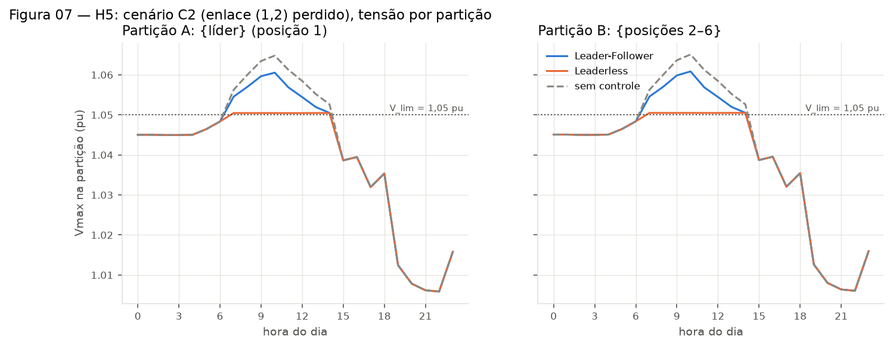

# TCC Facens: Controle Distribuído de Tensão sob Falhas de Comunicação

Impacto de falhas na camada de comunicação no consenso proporcional para corte de geração fotovoltaica (*fair power curtailment*) no alimentador IEEE 34 barras: comparação entre as arquiteturas **Leader-Follower** e **Leaderless**.

## Resumo científico

Seis GFVs (potências do cenário heterogêneo do CBA 2026) coordenam a fração de corte $\rho_i$ por consenso num grafo "linha com atalho". O experimento compara Leader-Follower (só o líder corrige pela tensão) e Leaderless (cada agente corrige pela tensão local) sob comunicação ideal (C0), perda de enlace (C1), particionamento que isola o líder (C2) e isolamento temporário do líder ou de um não líder (C3), e — como extensão — perda probabilística de mensagens com atraso. No caso estudado, o Leader-Follower falha quando o líder é isolado (8 horas de sobretensão), enquanto o Leaderless mantém a tensão com perda de proporcionalidade; perdas i.i.d. de até 20% não causaram violação.

## Problema investigado

O consenso proporcional para *curtailment* foi proposto supondo comunicação ideal. Como falhas de enlace, particionamento, isolamento de agentes e perda de mensagens afetam convergência, distribuição justa do corte e tensão — e a arquitetura do consenso altera essa robustez?

## Objetivo

Avaliar o efeito de falhas de comunicação sobre o consenso proporcional nas arquiteturas Leader-Follower e Leaderless, testando as hipóteses H1–H5 ([problema e hipóteses](docs/problema_hipoteses.md)).

## Métodos utilizados

AltDSS/OpenDSS em 24 *snapshots* horários (curvas do CBA 2026); líder escolhido pela violação acumulada $S_i$ sem controle; $\varepsilon = 2/\operatorname{tr}(L_0) = 1/6$; $\beta = 5$; parada elétrica com tolerância de 5×10⁻⁴ pu e até 500 iterações; métricas $e_c$, $N_{iter}$, $\sigma_r$ (global e por partição), $V_{\max}$, $\lambda_2$; canal probabilístico com perda, atraso, fila e semente.

## Estado atual

- Baseline determinístico executado e versionado (`Resultados/FASE0_EXP001`, commit `7219216`); números conferidos em 2026-10-09.
- Auditoria de 25/09 tratada em grande parte (canal probabilístico, testes, manifesto com *hashes*); baseline **não reexecutado** no código atual.
- Modo probabilístico executado com uma semente (`CHANNEL_TEST`, `CHANNEL_MULTI3`); **sem replicações** ainda.

## Estrutura do repositório

```text
README.md
docs/                                          documentação científica canônica (+ guia_didatico.md)
Experimento_Consenso_comunication_failure.py   experimento completo (AltDSS + consenso + falhas)
src/tcc_facens/communication.py                canal probabilístico (Message, CommunicationChannel)
src/tcc_facens/__init__.py                     entry point `tcc-facens`
scripts/run_channel_sweep.py                   replicações com sementes consecutivas
tests/test_experiment_structure.py             testes (pytest)
IEEE34bus/                                     rede (.dss, mesma do CBA) e coordenadas
Entradas/curvas_24h.csv                        curvas diárias (iguais às do CBA 2026)
Resultados/FASE0_EXP001*/                      config, manifest, raw, summary, tables, matrizes, logs, figures
experimento.md, implementacao.md               especificação de desenho e registro de implementação
revisao.md                                     auditoria de 25/09 (legado, consolidada em docs/auditoria.md)
Fase 0 - Idealização.md, Fase 0 - Corpus - Referências.md   concepção e corpus bibliográfico
Protocolos de comunicacao e sensibilidade.md, variaveis de analise   notas de apoio
papers/                                        PDFs de referência
Skills/                                        skills de agentes e planejamento dos Papers 2–4 do mestrado
documentacao_altdss.md                         documentação AltDSS-Python (terceiros)
```

## Instruções de execução

```bash
uv sync
uv run python Experimento_Consenso_comunication_failure.py      # baseline determinístico (~20 s)
uv run python Experimento_Consenso_comunication_failure.py --enable-channel \
  --loss-probability 0.05,0.1,0.2 --delay-steps 1 --seed 42 --output-dir Resultados/FASE0_EXP001_CHANNEL
uv run python scripts/run_channel_sweep.py --replications 30 --loss-probability 0.05 \
  --delay-steps 1 --seed 42 --output-dir Resultados/SWEEP_005PCT_1STEP
uv run pytest
```

Use uma pasta de saída separada para o modo probabilístico. Explicações passo a passo (instalação do `uv` e do Git, parâmetros do canal, semente, replicações, arquivos de evidência): [guia didático](docs/guia_didatico.md). Detalhes de parâmetros e saídas: [metodologia](docs/metodologia.md).

## Documentação científica

1. [Problema e hipóteses](docs/problema_hipoteses.md)
2. [Fundamentação teórica](docs/fundamentacao_teorica.md)
3. [Metodologia](docs/metodologia.md)
4. [Resultados e discussão](docs/resultados_discussao.md)
5. [Auditoria](docs/auditoria.md)

## Principais resultados e limitações

| Caso | $V_{\max}$ PV (pu) | Horas c/ violação | Corte (%) | $\sigma_r$ |
|---|---:|---:|---:|---:|
| Sem controle | 1,0651 | 8 | 0 | — |
| LF / C0 | 1,0505 | 0 | 41,64 | 0,008 |
| LF / C2 (líder isolado) | 1,0609 | 8 | 16,51 | 0,349 |
| LL / C2 | 1,0505 | 0 | 41,73 | 0,118 |
| LF / C3 falha longa do líder | 1,0609 | 1 | 35,52 | 0,063 |

- H1–H5 sustentadas **neste caso** (uma execução determinística).
- **Limitações:** sem replicações; $\beta$ idêntico entre arquiteturas (o LL tem mais atuadores ativos); adaptação de Kitso et al. sem decaimento; barras a montante até 1,0508 pu (fonte em 1,05 pu); quase-estático; grafo de comunicação é hipótese manual.


