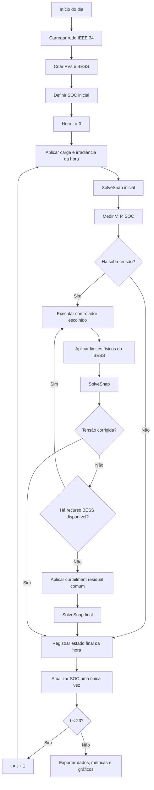
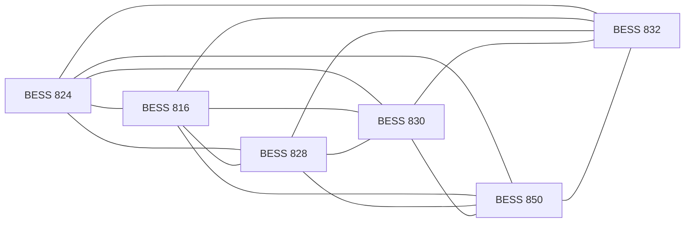
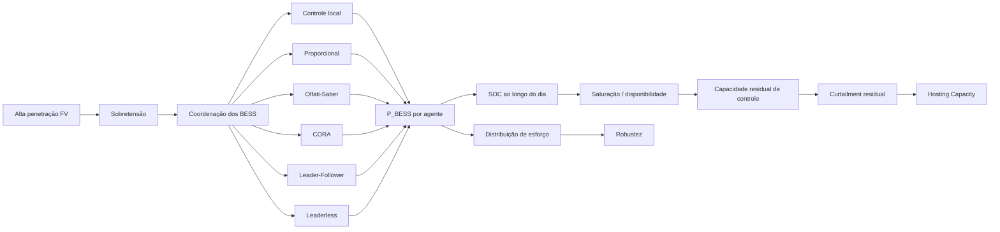

# Paper 2 — Mapa Conceitual e Roteiro Experimental

## Título de trabalho

**Distributed Coordination of Multiple Battery Energy Storage Systems for Voltage Regulation, PV Curtailment Mitigation and Hosting Capacity Enhancement in an Unbalanced Distribution Feeder**

---

# 1. Pergunta científica central

> **Como diferentes estratégias de coordenação distribuída alteram a utilização, saturação e robustez de múltiplos BESS empregados na mitigação de sobretensão em uma rede com alta penetração fotovoltaica?**

A diferença essencial em relação ao Paper 1 é que o recurso controlado deixa de ser diretamente o corte da geração fotovoltaica e passa a ser o **armazenamento distribuído com memória temporal e limites físicos**.

A lógica geral do estudo é:

\[
\boxed{\text{Consenso}\rightarrow\text{BESS}\rightarrow\text{Curtailment residual}}
\]

O armazenamento passa a ser limitado por:

- potência de carga;
- potência de descarga;
- capacidade energética;
- SOC mínimo e máximo;
- eficiência;
- disponibilidade do agente.

---

# 2. Hipóteses científicas

## H2.1 — Coordenação e distribuição de esforço

> Diferentes arquiteturas de consenso, mesmo produzindo regulação de tensão semelhante, resultam em diferentes distribuições de utilização dos BESS e, consequentemente, diferentes instantes de saturação e necessidade de curtailment.

É possível que dois métodos produzam:

\[
V_{\max}\le1.05
\]

mas terminem o dia com distribuições muito diferentes de SOC.

Exemplo conceitual:

\[
SOC=[80,80,35,22]\%
\]

versus:

\[
SOC=[58,61,57,59]\%.
\]

Portanto, tensão máxima isoladamente não é suficiente para caracterizar a qualidade da coordenação.

---

## H2.2 — Saturação e curtailment

> Estratégias que distribuem melhor o esforço entre os BESS tendem a retardar a saturação de unidades individuais e podem reduzir o curtailment residual.

A hipótese é propositalmente formulada como **pode reduzir**, e não como resultado antecipado.

---

## H2.3 — Robustez à indisponibilidade

> Estratégias distribuídas diferem na capacidade de manter a regulação de tensão quando um BESS atinge o limite de SOC ou se torna indisponível.

Esse ponto será testado em cenários específicos de:

- SOC inicial heterogêneo;
- saturação durante a janela crítica;
- indisponibilidade de um agente.

---

## H2.4 — Hosting Capacity

> A arquitetura de coordenação pode alterar a hosting capacity mesmo quando potência e energia totais instaladas de BESS permanecem idênticas.

Isto é:

\[
\boxed{\text{mesmo hardware}\neq\text{mesma Hosting Capacity}}
\]

quando o despacho dos recursos é diferente.

---

# 3. Objetivo geral

Avaliar comparativamente estratégias locais e distribuídas de coordenação de múltiplos BESS, submetidos a limites físicos de potência e energia, para mitigação de sobretensão causada por alta penetração fotovoltaica, quantificando:

- utilização dos BESS;
- distribuição do SOC;
- saturação;
- robustez;
- curtailment residual;
- hosting capacity.

---

# 4. Objetivos específicos

1. Construir um executor determinístico de 24 snapshots horários controlados pelo Python.
2. Implementar um modelo físico comum de BESS para todos os métodos.
3. Calibrar um sizing experimental que não torne o problema trivial.
4. Reproduzir controles já conhecidos:
   - local;
   - proporcional;
   - Olfati-Saber;
   - CORA/iCORA;
   - leader–follower;
   - leaderless.
5. Comparar os métodos sob:
   - condição nominal;
   - SOC heterogêneo;
   - indisponibilidade de agente.
6. Quantificar:
   - tensão;
   - energia absorvida;
   - dispersão de utilização;
   - saturação;
   - curtailment;
   - hosting capacity.
7. Identificar trade-offs entre desempenho elétrico, equilíbrio de uso e robustez.

---

# 5. Referências principais e função no Paper 2

| Função no estudo | Referência principal | Papel |
|---|---|---|
| Fundamento matemático de consenso | Olfati-Saber, Fax & Murray (2007) | matrizes \(A,D,L\), convergência e consenso multiagente |
| BESS + consenso + SOC | Zeraati et al. (2018) | coordenação distribuída de BESS para regulação de tensão |
| Coordenação de múltiplos BESS | Wang et al. (2015) | antecedente de coordenação em redes de baixa tensão |
| Controle local de storage | Procopiou et al. (2019) | benchmark descentralizado/local |
| Leader–Follower × Leaderless | Kitso et al. (2025) | comparação de arquiteturas, SOC e robustez |
| Supportive consensus / CORA | Palomares et al. (2020) | saturação e redistribuição de resíduos |
| Continuidade com nossa linha | Giacomini et al. | aplicação de consenso em regulação de tensão |
| Curtailment ativo | Tonkoski et al. (2011) | referência clássica para corte ativo |
| BESS antes do curtailment | Acosta-Campas et al. (2023) | sequência armazenamento → corte residual |
| Alimentador | IEEE 34 / Kersting | sistema de referência |

## Paper-âncora

**Kitso et al. (2025)** deve ser um dos principais papers de contexto porque trabalha diretamente com:

- múltiplos BESS;
- rede de distribuição;
- sobretensão por FV;
- leader–follower;
- leaderless;
- SOC inicial diferente;
- indisponibilidade de agentes;
- distribuição desigual de utilização.

O artigo mostra que métodos distintos podem regular tensão, mas produzir respostas muito diferentes quanto ao equilíbrio dos BESS.

---

# 6. Sistema físico a congelar

## Rede

- IEEE 34 barras;
- AltDSS-Python;
- rede trifásica desequilibrada;
- solução por snapshots.

## Barras com PV/BESS

Proposta inicial, preservando continuidade com o Paper 1:

\[
\mathcal{N}_{PV/BESS}
=
\{824,816,828,830,850,832\}
\]

## Potências FV base

\[
P_{PV}^{base}
=
[150,125,100,130,90,115]\;kW
\]

A potência instalada de cada unidade será escalada por:

\[
P_{PV,i}^{(\lambda)}
=
\lambda P_{PV,i}^{base}
\]

onde \(\lambda\) será usado posteriormente na varredura de Hosting Capacity.

---

# 7. Curvas temporais

Para cada carga \(j\):

\[
P_{load,j}(t)
=
P_{load,j}^{nom}L_j(t)
\]

Para cada PV \(i\):

\[
P_{PV,disp,i}(t)
=
P_{PV,i}^{(\lambda)}G(t)
\]

onde:

- \(L_j(t)\) = fator da curva de carga;
- \(G(t)\) = irradiância normalizada;
- \(t=0,\ldots,23\).

---

# 8. Regra temporal fundamental

A simulação diária será executada em:

\[
24\text{ snapshots}\times1h
\]

mas **sem usar o avanço temporal automático do `Daily` nativo como motor do experimento**.

O Python controla explicitamente cada instante.

## Regra

Uma hora pode conter várias soluções elétricas e várias iterações de consenso.

Porém:

\[
\boxed{\text{o SOC só pode ser integrado uma única vez por hora}}
\]

As iterações internas de consenso **não representam avanço temporal**.

---

# 9. Diagrama geral do executor



---

# 10. Modelo físico comum do BESS

Todos os métodos devem enxergar o **mesmo equipamento físico**.

## Estado de carga

\[
SOC_i(t)
=
\frac{E_i(t)}{E_{nom,i}}
\]

com:

\[
SOC_{min}
\le
SOC_i(t)
\le
SOC_{max}.
\]

---

## Dinâmica energética

\[
E_i(t+\Delta t)
=
E_i(t)
+
\eta_cP_{ch,i}(t)\Delta t
-
\frac{P_{dis,i}(t)\Delta t}{\eta_d}
\]

onde:

- \(E_i\) = energia armazenada;
- \(\eta_c\) = eficiência de carga;
- \(\eta_d\) = eficiência de descarga;
- \(P_{ch,i}\) = potência de carga;
- \(P_{dis,i}\) = potência de descarga.

No Paper 2, a descarga pode permanecer desativada:

\[
P_{dis,i}=0
\]

na operação nominal.

A estrutura, porém, deve ficar pronta para o Paper 3.

---

## Potência máxima de carga disponível

\[
P_{ch,i}^{avail}(t)
=
\min
\left[
P_{ch,i}^{max},
\frac{(SOC_{max}-SOC_i(t))E_{nom,i}}
{\eta_c\Delta t}
\right].
\]

O comando efetivamente aplicado é:

\[
P_{ch,i}(t)
=
\operatorname{clip}
\left(
P_{ch,i}^{ref},
0,
P_{ch,i}^{avail}
\right).
\]

---

## Limite do conversor BESS

Se:

\[
Q_{BESS}=0
\]

então:

\[
P_{ch,i}\le S_{BESS,i}.
\]

Neste paper, isso se reduz praticamente ao limite de kW, mas a separação deve existir no modelo.

---

# 11. Balanço de potência ativa

Para cada unidade \(i\):

\[
P_{inj,i}(t)
=
P_{PV,gen,i}(t)
-
P_{load,i}(t)
-
P_{ch,i}(t)
+
P_{dis,i}(t).
\]

No Paper 2:

\[
P_{dis,i}(t)=0.
\]

---

# 12. Curtailment residual

A geração efetiva deve obedecer:

\[
0
\le
P_{PV,gen,i}(t)
\le
P_{PV,disp,i}(t).
\]

O curtailment instantâneo é:

\[
P_{curt,i}(t)
=
P_{PV,disp,i}(t)
-
P_{PV,gen,i}(t).
\]

A energia total cortada é:

\[
E_{curt}
=
\sum_t
\sum_i
P_{curt,i}(t)\Delta t.
\]

## Regra metodológica

O curtailment é um **fallback comum a todos os métodos**.

A sequência é:

\[
\boxed{
\text{BESS coordination}
\rightarrow
\text{saturação/indisponibilidade}
\rightarrow
\text{curtailment residual}
}
\]

A lógica de curtailment não pode mudar entre os métodos, para não introduzir uma segunda variável experimental.

---

# 13. Grafo de comunicação

Para \(n=6\) agentes:

\[
A=[a_{ij}]
\]

\[
D=
\operatorname{diag}
\left(
\sum_j a_{ij}
\right)
\]

\[
L=D-A.
\]

## Regra experimental

Usar inicialmente **uma única topologia de comunicação** para todos os algoritmos distribuídos.

A topologia não deve mudar junto com o método.

Uma análise posterior pode comparar:

\[
\text{grafo completo}
\]

versus:

\[
\text{grafo esparso}
\]

mas apenas como sensibilidade.

---

# 14. Diagrama dos agentes



Esse grafo completo é apenas o ponto de partida.

A topologia final deve ser congelada antes do experimento principal.

---

# 15. Controladores candidatos

## C0 — Sem controle

\[
P_{ch,i}=0
\]

\[
P_{curt,i}=0
\]

Objetivo:

- caracterizar o problema elétrico;
- identificar horários e barras críticas.

---

# 16. C1 — Controle local

Cada BESS reage apenas à tensão da própria barra.

Erro local:

\[
e_i(t)
=
\max(0,V_i(t)-V_{lim})
\]

Comando:

\[
P_{ch,i}^{ref}
=
\operatorname{clip}
\left(
K_v e_i,
0,
P_{ch,i}^{avail}
\right).
\]

Características:

- sem comunicação;
- benchmark descentralizado;
- tendência potencial a concentrar esforço nos nós críticos.

---

# 17. C2 — Consenso proporcional

Define-se um fator de utilização:

\[
0\le u_i\le1
\]

e:

\[
P_{ch,i}^{ref}
=
u_iP_{ch,i}^{max}.
\]

A atualização é:

\[
u_i^{k+1}
=
\operatorname{clip}
\left[
u_i^k
+
\epsilon
\sum_j
a_{ij}
(u_j^k-u_i^k)
+
b_iK_ve_V^k,
0,
1
\right]
\]

com:

\[
e_V^k
=
\max(0,V_{mon}^k-V_{lim}).
\]

Este método é a adaptação do consenso proporcional já usado no Paper 1.

No Paper 1, o fator proporcional modulava potência FV.

No Paper 2, passa a modular:

\[
P_{BESS}.
\]

---

# 18. C3 — Olfati-Saber

Forma geral:

\[
X_i^{k+1}
=
X_i^k
+
\frac{\epsilon}{w_i}
\sum_j
a_{ij}
\left(
\frac{X_j^k}{c_j}
-
\frac{X_i^k}{c_i}
\right)
+
\beta_i e_V^k.
\]

Definições:

\[
X_i=P_{ch,i}^{ref}
\]

\[
c_i=P_{ch,i}^{max}.
\]

O termo externo é:

\[
e_V^k
=
\max(0,V_{mon}^k-V_{lim}).
\]

## Atenção ao sinal

Nos códigos antigos de curtailment:

\[
V\uparrow
\Rightarrow
P_{PV}\downarrow.
\]

Para BESS:

\[
V\uparrow
\Rightarrow
P_{ch}\uparrow.
\]

Portanto, o sinal do termo de correção por tensão deve ser coerente com a nova variável controlada.

---

# 19. C4 — CORA / Supportive Consensus

A lógica central é:

1. calcular atualização;
2. aplicar saturação;
3. calcular resíduo;
4. redistribuir o resíduo entre agentes disponíveis.

Estado intermediário:

\[
z_i^k
=
x_i^k+s_i^k
\]

Atualização:

\[
\hat z_i^{k+1}
=
z_i^k
+
\epsilon
\sum_j
a_{ij}
(z_j^k-z_i^k)
+
\beta_i e_V.
\]

Saturação:

\[
x_i^{k+1}
=
\operatorname{clip}
\left(
\hat z_i^{k+1},
0,
P_{ch,i}^{avail}
\right).
\]

Resíduo:

\[
\delta_i^{k+1}
=
\hat z_i^{k+1}
-
x_i^{k+1}.
\]

Redistribuição:

\[
s_i^{r+1}
=
\delta_i
+
\epsilon
\sum_j
a_{ij}
(\delta_j-\delta_i).
\]

Esse método é particularmente relevante porque o Paper 2 pretende estudar justamente:

- saturação;
- indisponibilidade;
- redistribuição de esforço.

---

# 20. C5 — Leader–Follower baseado em Kitso

Kitso et al. trabalham com fator de utilização.

Para o líder:

\[
U_L(k)
=
U_L(k-1)
+
G_{ov}
[V_L(k)-1.05].
\]

Os seguidores convergem para a informação transmitida pela rede.

Forma geral:

\[
U_i(k)
=
\sum_j
C_{ij}U_j(k-1).
\]

Potência de referência:

\[
P_{ch,i}^{ref}
=
P_{nom,i}U_i.
\]

Quando o SOC atinge o limite:

\[
SOC_i=SOC_{max}
\]

o agente é marcado como indisponível.

A coordenação continua usando os agentes restantes.

## Nome sugerido no código

```text
leader_follower_kitso
```

Isso evita confundir esse método com versões históricas de líder fixo usadas nos nossos scripts.

---

# 21. C6 — Leaderless baseado em Kitso

Primeiro cada agente calcula sua necessidade local:

\[
U_i(k)
=
U_i(k-1)
+
G_{ov}
[V_i(k)-V_{lim}]
\]

quando há sobretensão.

Depois:

\[
U_{cons,i}(k)
=
U_i(k)
+
\epsilon
\sum_{j\in\mathcal N_i}
a_{ij}
[
U_j(k)-U_i(k)
].
\]

A implementação fiel ao paper ainda deve incluir a lógica adicional de controle de SOC.

A potência é:

\[
P_{ref,i}
=
P_{nom,i}U_{f,i}.
\]

Esse método deverá ser reproduzido de forma separada, sem simplificações silenciosas.

---

# 22. Screening dos métodos

Executar inicialmente:

\[
C0,C1,C2,C3,C4,C5,C6.
\]

Não significa que todos entrarão no artigo final.

## Critérios para permanecer no Paper 2

1. representar uma família metodológica distinta;
2. possuir comportamento não redundante;
3. possuir base acadêmica clara;
4. ajudar a responder às hipóteses.

É provável que o paper final contenha:

\[
C0+C1+3\text{ ou }4\text{ métodos distribuídos}.
\]

---

# 23. Sizing experimental

Não manter automaticamente:

\[
800\;kW/4000\;kWh
\]

por BESS.

Isso pode tornar o sistema artificialmente superdimensionado.

## Razão de potência

\[
r_P
=
\frac{
\sum_iP_{BESS,i}^{max}
}{
\sum_iP_{PV,i}^{nom}
}
\]

## Razão energética

\[
r_E
=
\frac{
\sum_iE_{BESS,i}^{nom}
}{
E_{PV,excesso}
}
\]

## Duração equivalente

\[
H_i
=
\frac{
E_{nom,i}
}{
P_{BESS,i}^{max}
}.
\]

---

# 24. Critério para escolher o sizing

O sizing experimental final deve produzir uma região não trivial:

- sem BESS há sobretensão;
- o BESS consegue corrigir uma parte relevante do problema;
- em cenários de estresse ocorre saturação;
- o curtailment residual não é sempre zero;
- todos os métodos não podem falhar imediatamente.

O sizing não precisa ser economicamente ótimo neste paper.

Ele precisa ser **experimentalmente informativo**.

---

# 25. Matriz de experimentos

## Bloco A — Condição nominal

Todos os BESS começam com:

\[
SOC_i(0)=SOC_0.
\]

Todos disponíveis.

Objetivo:

- caracterizar o comportamento básico de cada controlador.

---

## Bloco B — SOC inicial heterogêneo

\[
SOC_i(0)\neq SOC_j(0).
\]

Objetivo:

- verificar equilíbrio;
- detectar saturação precoce;
- comparar redistribuição de esforço.

---

## Bloco C — Indisponibilidade

Durante uma janela crítica:

\[
availability_m(t)=0.
\]

O BESS \(m\) deixa de participar.

Objetivo:

- medir robustez;
- verificar redistribuição;
- avaliar capacidade de continuar regulando tensão.

---

## Bloco D — Hosting Capacity

Aumentar:

\[
\lambda.
\]

Exemplo:

\[
\lambda
=
1.0,\,
1.1,\,
1.2,\,
\ldots
\]

até atingir o limite definido.

---

# 26. Hosting Capacity

A HC do método \(M\) será:

\[
HC_M
=
\lambda_M^{max}
\sum_i
P_{PV,i}^{base}.
\]

A condição elétrica é:

\[
V_{min}
\le
V_b^\phi(t)
\le
V_{max}
\]

para:

- todas as barras;
- todas as fases;
- todos os horários.

---

# 27. Duas definições úteis de HC

## HC sem curtailment

\[
HC^{0curt}
\]

Maior capacidade FV que pode ser hospedada sem corte ativo.

## HC operacional

Permite fallback de curtailment, mas deve ser acompanhada de:

\[
HCC
=
\frac{E_{curt}}
{E_{PV,disp}}.
\]

Isso evita interpretar como “maior HC” um método que simplesmente aceita potência instalada elevada e corta grande parte da geração.

---

# 28. Métricas elétricas

## Tensão máxima

\[
V_{max}(t).
\]

## Tensão mínima

\[
V_{min}(t).
\]

## Número de violações

\[
N_{viol}.
\]

## Duração das violações

\[
T_{viol}.
\]

---

# 29. Métricas do BESS

## Potência

\[
P_{BESS,i}(t).
\]

## Energia processada

\[
E_{BESS,i}
=
\sum_t
P_{ch,i}(t)\Delta t.
\]

## Perfil de SOC

\[
SOC_i(t).
\]

## Primeira saturação

\[
t_{sat,1}
=
\text{instante da primeira saturação}.
\]

## Número de unidades saturadas

\[
N_{sat}.
\]

---

# 30. Métrica de utilização relativa

Para BESS heterogêneos, não comparar apenas kWh absolutos.

Definir:

\[
u_i^{energy}
=
\frac{
E_{BESS,i}
}{
E_{usable,i}
}
\]

onde:

\[
E_{usable,i}
=
E_{nom,i}
(SOC_{max}-SOC_{min}).
\]

---

# 31. Métrica de desigualdade

Usar o coeficiente de variação:

\[
CV_u
=
\frac{
\sigma(u_i^{energy})
}{
\mu(u_i^{energy})
}.
\]

Interpretação:

- menor \(CV_u\) → uso mais homogêneo;
- maior \(CV_u\) → concentração de esforço.

---

# 32. Métricas de curtailment

## Potência cortada

\[
P_{curt,i}(t)
=
P_{PV,disp,i}(t)
-
P_{PV,gen,i}(t).
\]

## Energia cortada

\[
E_{curt}
=
\sum_t
\sum_i
P_{curt,i}(t)\Delta t.
\]

## Percentual

\[
Curt\%
=
100
\frac{
E_{curt}
}{
E_{PV,disp}
}.
\]

---

# 33. Métricas computacionais

Registrar:

\[
N_{iter}(t)
\]

e, quando possível:

\[
N_{msg}(t)
\]

além do tempo computacional.

Essas métricas não precisam ser contribuição principal, mas ajudam a explicar trade-offs.

---

# 34. Estrutura de saída do executor

```text
Resultados/
├── config.yaml
├── manifest.json
├── raw/
│   ├── timestep.csv
│   ├── agents.csv
│   ├── buses.csv
│   └── consensus_iterations.csv
├── summary/
│   ├── methods.csv
│   ├── bess.csv
│   ├── curtailment.csv
│   └── hosting_capacity.csv
├── figures/
└── tables/
```

---

# 35. Campos mínimos por passo

Cada registro deve carregar:

```text
scenario
method
lambda_pv
hour
agent
bus
Vmax
Vmin
Ppv_available
Ppv_generated
P_bess_ref
P_bess_real
SOC_initial
SOC_final
P_curt
iterations
available_agent
status
```

---

# 36. Figuras previstas

## Figura 1 — Sistema e grafo de comunicação

- IEEE 34;
- seis pares PV/BESS;
- grafo dos agentes.

## Figura 2 — Fluxo experimental

- snapshots;
- controlador;
- saturação;
- curtailment;
- atualização SOC.

## Figura 3 — Tensão por método

\[
V_{max}(t)
\]

## Figura 4 — SOC dos seis BESS

\[
SOC_i(t)
\]

## Figura 5 — Potência dos BESS

\[
P_{BESS,i}(t)
\]

## Figura 6 — Utilização relativa

\[
u_i^{energy}
\]

## Figura 7 — Curtailment por método

\[
E_{curt}
\]

## Figura 8 — Robustez com agente indisponível

## Figura 9 — Hosting Capacity

\[
HC_M
\]

e/ou:

\[
HCC(\lambda).
\]

---

# 37. Tabelas previstas

## Tabela I — Parâmetros físicos

- PV;
- BESS;
- SOC;
- eficiência;
- tensão;
- timestep.

## Tabela II — Métodos

- local;
- proporcional;
- Olfati;
- CORA;
- LF-Kitso;
- leaderless-Kitso.

## Tabela III — Cenário nominal

- tensão;
- energia BESS;
- dispersão;
- curtailment.

## Tabela IV — Robustez

- SOC heterogêneo;
- indisponibilidade.

## Tabela V — Hosting Capacity

---

# 38. Ordem de implementação

A ordem recomendada é:

1. executor determinístico de 24 snapshots;
2. caso sem controle reproduzível;
3. Storage físico com SOC correto;
4. sizing experimental;
5. controle local;
6. consenso proporcional;
7. validação de balanços de energia;
8. Olfati-Saber;
9. CORA;
10. LF-Kitso;
11. leaderless-Kitso;
12. SOC heterogêneo;
13. indisponibilidade;
14. Hosting Capacity;
15. seleção dos métodos finais do paper.

---

# 39. Checks obrigatórios de validade

## PV

\[
P_{PV,gen}
\le
P_{PV,disp}.
\]

## SOC

\[
SOC_{min}
\le
SOC_i
\le
SOC_{max}.
\]

## Potência do BESS

\[
P_{ch,i}
\le
P_{ch,max,i}.
\]

## Curtailment

\[
P_{curt}
\ge0.
\]

## Balanço FV

\[
E_{PV,disp}
=
E_{PV,gen}
+
E_{curt}.
\]

## Balanço energético do BESS

\[
\Delta E_i
\approx
\eta_cE_{ch,i}
-
\frac{E_{dis,i}}{\eta_d}.
\]

---

# 40. Flags de execução

Cada passo deve registrar:

- convergência elétrica;
- convergência do consenso;
- `max_iter`;
- agente saturado;
- agente indisponível;
- curtailment acionado;
- importação indesejada;
- limite energético atingido.

---

# 41. Núcleo causal do Paper 2

Todo o desenho experimental deve ser reduzido à seguinte estrutura:

\[
\boxed{
\text{mesma rede}
+
\text{mesmo FV}
+
\text{mesmo BESS}
+
\text{mesmo SOC}
+
\text{mesmos limites}
}
\]

A única variável estrutural é:

\[
\boxed{
\text{algoritmo de coordenação}
}
\]

que determina:

\[
P_{BESS,i}(t)
\]

e, por consequência:

\[
SOC_i(t)
\rightarrow
saturação
\rightarrow
robustez
\rightarrow
curtailment
\rightarrow
HC.
\]

---

# 42. Mapa conceitual resumido



---

# 43. Resultado científico esperado

O objetivo não é provar que existe um único método superior em todos os critérios.

O resultado esperado é identificar **trade-offs** entre:

- capacidade de regular tensão;
- uniformidade de utilização;
- robustez a saturação;
- robustez à indisponibilidade;
- curtailment residual;
- hosting capacity;
- esforço computacional.

Exemplos de resultados possíveis:

\[
CORA
\rightarrow
\text{melhor redistribuição após saturação}
\]

\[
Leaderless
\rightarrow
\text{melhor uniformidade de SOC}
\]

\[
Leader-Follower
\rightarrow
\text{menor complexidade}
\]

\[
Controle\ local
\rightarrow
\text{maior concentração de esforço}
\]

Esses resultados devem emergir da simulação, e não ser assumidos previamente.

---

# 44. Contribuição científica pretendida

A contribuição não deve ser apresentada como:

> “novo algoritmo de consenso”.

O Paper 2 pode ser academicamente mais forte se formulado como:

> **avaliação sistemática e causal de como diferentes arquiteturas distribuídas de coordenação de BESS alteram a utilização do armazenamento, saturação, robustez, curtailment residual e hosting capacity em uma rede trifásica desequilibrada com alta penetração FV.**

O diferencial está na integração entre:

\[
\text{consenso}
+
\text{SOC}
+
\text{saturação}
+
\text{curtailment}
+
\text{HC}
\]

sob condições físicas idênticas.

---

# 45. Próxima ação prática

A primeira implementação não deve começar pelos novos algoritmos.

A sequência imediata é:

1. congelar a configuração do IEEE 34;
2. confirmar barras e potências FV;
3. definir curvas de carga e irradiância;
4. substituir o avanço automático por 24 snapshots controlados explicitamente;
5. validar o caso sem controle;
6. implementar o BESS físico comum;
7. realizar o pre-experimento de sizing;
8. somente então conectar os métodos de consenso.

Esse é o ponto de partida operacional do Paper 2.
