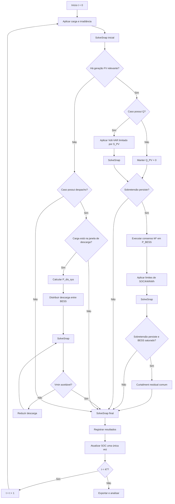
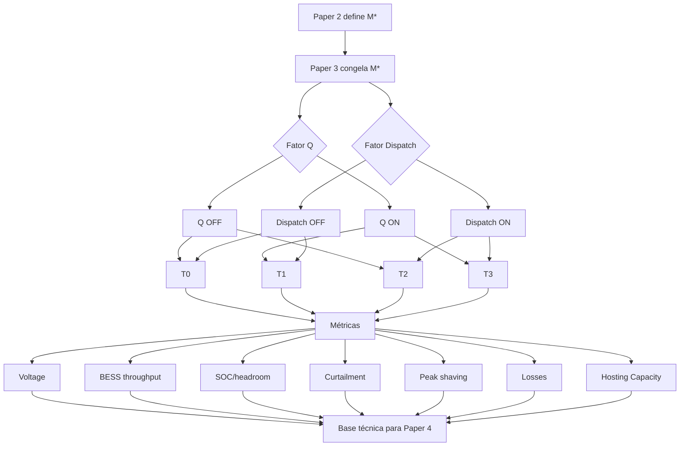

# Paper 3 — Mapa Conceitual e Roteiro Experimental

## Título de trabalho

**Coordinated Multi-Resource Voltage and Energy Management in PV-Rich Distribution Networks Using Reactive Power and Battery Energy Storage**

Título alternativo, caso o foco final fique mais explícito em Hosting Capacity:

**Hierarchical PV Inverter Reactive Support and BESS Dispatch for Voltage Regulation, Curtailment Reduction and Hosting Capacity Enhancement**

---

# 1. Posição do Paper 3 na linha de pesquisa

O Paper 3 **não deve voltar a comparar algoritmos de consenso**.

Essa pergunta pertence ao Paper 2.

O Paper 3 parte do seguinte pressuposto:

\[
\boxed{
M^\star
=
\text{arquitetura de coordenação selecionada no Paper 2}
}
\]

onde \(M^\star\) pode ser, conforme os resultados do Paper 2:

- Proporcional;
- Olfati-Saber;
- CORA/iCORA;
- Leader–Follower;
- Leaderless.

No Paper 3, \(M^\star\) permanece **fixo em todos os cenários**.

A variável científica muda.

A nova pergunta passa a ser:

> **Como utilizar de forma coordenada recursos energéticos e não energéticos — potência reativa dos inversores FV, carga/descarga dos BESS e curtailment residual — ao longo do ciclo diário para melhorar o desempenho técnico da rede?**

A arquitetura deixa de ser apenas:

\[
\text{Consenso}
\rightarrow
P_{BESS,ch}
\rightarrow
Curtailment
\]

e passa a incorporar:

\[
\boxed{
Q_{PV}
\rightarrow
P_{BESS,ch}
\rightarrow
Curtailment
}
\]

durante o período de geração FV e:

\[
\boxed{
P_{BESS,dis}
}
\]

durante o período de maior demanda ou recuperação energética noturna.

---

# 2. Pergunta científica central

> **Qual é o efeito incremental e combinado do suporte reativo dos inversores fotovoltaicos e do despacho temporal dos BESS sobre tensão, throughput do armazenamento, curtailment, prontidão energética para o ciclo seguinte e Hosting Capacity?**

A pergunta deve ser respondida mantendo constantes:

- rede;
- posições dos PVs;
- posições dos BESS;
- potência e energia dos BESS;
- SOC inicial;
- eficiência;
- controlador distribuído \(M^\star\);
- perfis de carga e irradiância;
- política de curtailment residual;
- limites elétricos.

---

# 3. Hipóteses científicas

## H3.1 — Uso de \(Q\) antes da energia armazenada

> A utilização prioritária da potência reativa disponível nos inversores FV reduz a potência e/ou energia ativa exigida dos BESS para mitigação de sobretensão, mantendo o atendimento aos limites de tensão.

Comparação causal:

\[
P_{BESS}
\rightarrow
Curtailment
\]

versus:

\[
Q_{PV}
\rightarrow
P_{BESS}
\rightarrow
Curtailment.
\]

O objetivo não é assumir que \(Q\) será sempre eficaz.

A efetividade deve depender das características elétricas do alimentador, incluindo sua sensibilidade de tensão a \(P\) e \(Q\).

---

## H3.2 — Despacho temporal e recuperação de headroom

> A descarga programada após o período solar recupera margem energética dos BESS para o ciclo fotovoltaico seguinte e pode reduzir a saturação e o curtailment no dia subsequente.

Define-se o headroom energético:

\[
H_i(t)
=
E_{max,i}
-
E_i(t).
\]

A descarga noturna deve aumentar:

\[
H_i(t_{sunrise})
\]

antes do novo ciclo solar.

---

## H3.3 — Qualidade elétrica durante a descarga

> O despacho noturno dos BESS pode reduzir pico de demanda, queda de tensão e/ou carregamento do alimentador, desde que respeite os limites mínimos de SOC e tensão.

Portanto, a descarga não deve ser tratada apenas como mecanismo para “esvaziar a bateria”.

Ela deve prestar uma função elétrica mensurável.

---

## H3.4 — Interação entre \(Q\) e despacho temporal

> O efeito conjunto de \(Q_{PV}\) e despacho temporal dos BESS pode ser diferente da soma dos efeitos individuais de cada recurso.

Essa hipótese justifica um desenho experimental fatorial.

Em termos gerais:

\[
\Delta_{Q+Dispatch}
\neq
\Delta_Q
+
\Delta_{Dispatch}.
\]

---

## H3.5 — Hosting Capacity multi-recurso

> A combinação de suporte reativo, armazenamento e recuperação noturna de SOC pode alterar a Hosting Capacity obtida com o mesmo hardware utilizado no Paper 2.

Ou seja:

\[
HC_{multi-resource}
\neq
HC_{P-only}.
\]

---

# 4. Objetivo geral

Desenvolver e avaliar uma estratégia técnica hierárquica de utilização de múltiplos recursos de flexibilidade — potência reativa dos inversores FV, carga e descarga de BESS e curtailment residual — mantendo fixa a arquitetura de coordenação distribuída selecionada no Paper 2.

---

# 5. Objetivos específicos

1. Caracterizar a sensibilidade da IEEE 34 a variações de potência ativa e reativa.
2. Implementar suporte reativo fisicamente limitado nos PVSystems.
3. Manter o controlador \(M^\star\) do Paper 2 inalterado para o despacho ativo dos BESS.
4. Implementar despacho noturno tecnicamente orientado.
5. Garantir recuperação controlada de headroom energético antes do novo ciclo solar.
6. Separar experimentalmente:
   - efeito de \(Q\);
   - efeito do despacho;
   - interação \(Q\times despacho\).
7. Quantificar impactos sobre:
   - tensão;
   - energia carregada;
   - energia descarregada;
   - throughput;
   - SOC;
   - curtailment;
   - peak shaving;
   - perdas;
   - Hosting Capacity.
8. Preparar as grandezas técnicas que serão utilizadas no Paper 4 econômico.

---

# 6. Referências necessárias e função no Paper 3

| Função no estudo | Referência principal | Papel |
|---|---|---|
| Base de consenso | método selecionado no Paper 2 | coordenação \(P_{BESS}\) mantida fixa |
| Suporte reativo antes do BESS | Li et al. (2024) | arquitetura em estágios envolvendo \(Q\) e ESS |
| Coordenação \(P/Q\) e sensibilidade | Rezaei & Esmaeili (2024) | interação entre potência ativa, reativa e tensão |
| Restrições físicas \(P/Q/S\) | Zafar et al. (2018) | capacidade aparente e dinâmica do armazenamento |
| BESS seguido de curtailment | Acosta-Campas et al. (2023) | curtailment residual após limitação do armazenamento |
| Coordenação multi-BESS | Kitso et al. (2025) | referência de arquitetura distribuída e SOC |
| Controle local/decentralizado de storage | Procopiou et al. (2019) | comparação e comportamento de BESS em redes ricas em FV |
| Gestão de energia em storage | Byrne et al. (2018) | enquadramento de despacho e serviços do BESS |
| Volt-VAR | IEEE Std 1547 | referência normativa para comportamento Volt-VAR |
| Alimentador | IEEE 34 / Kersting | sistema de teste |
| Continuidade com Paper 1 | estudo de curtailment + PLD | base energética para posterior Paper 4 |
| Continuidade com Paper 2 | resultados de \(M^\star\) | escolha fixa do controlador |

## Referências-âncora

O Paper 3 deve se apoiar principalmente em quatro blocos:

1. **Paper 2 / Kitso / Zeraati** — arquitetura distribuída do BESS;
2. **Li et al.** — precedência de suporte reativo antes do recurso energético;
3. **Rezaei & Esmaeili / Zafar** — limites físicos e interação \(P-Q-S\);
4. **Acosta-Campas** — curtailment como recurso residual.

---

# 7. Decisão metodológica principal

O Paper 3 não deve testar simultaneamente:

- vários consensos;
- vários controladores de \(Q\);
- várias políticas de descarga;
- vários modelos econômicos.

A estrutura principal deve congelar:

\[
M^\star
\]

e alterar apenas dois fatores:

\[
Q
\]

e:

\[
Dispatch.
\]

---

# 8. Desenho experimental fatorial \(2\times2\)

| Caso | Suporte \(Q_{PV}\) | Despacho noturno | Consenso |
|---|---:|---:|---|
| **T0** | Não | Não | \(M^\star\) |
| **T1** | Sim | Não | \(M^\star\) |
| **T2** | Não | Sim | \(M^\star\) |
| **T3** | Sim | Sim | \(M^\star\) |

Todas as demais condições permanecem idênticas.

## Efeito de \(Q\)

\[
Effect_Q
=
Y_{T1}
-
Y_{T0}.
\]

## Efeito do despacho

\[
Effect_D
=
Y_{T2}
-
Y_{T0}.
\]

## Interação

\[
Interaction_{Q,D}
=
(Y_{T3}-Y_{T2})
-
(Y_{T1}-Y_{T0}).
\]

Isso pode ser calculado para:

- curtailment;
- throughput;
- tensão;
- perdas;
- headroom;
- HC.

---

# 9. Rede e infraestrutura herdadas do Paper 2

Manter:

- IEEE 34 barras;
- AltDSS-Python;
- mesmos PVs;
- mesmos BESS;
- mesmas posições;
- mesmo sizing;
- mesmos perfis;
- mesmo SOC inicial;
- mesmo limite de tensão;
- mesmo grafo;
- mesmo controlador \(M^\star\).

A mudança deve ser apenas operacional.

---

# 10. Horizonte temporal

Para o Paper 2, um dia de 24 h é suficiente para estudar carregamento e saturação.

Para o Paper 3, a introdução de descarga noturna cria uma nova exigência:

> o benefício da descarga deve aparecer no ciclo solar seguinte.

Portanto, recomenda-se como experimento principal:

\[
\boxed{
48\text{ h}
=
2\text{ dias consecutivos}
}
\]

com passo inicial de:

\[
\Delta t=1h.
\]

Total:

\[
48\text{ snapshots}.
\]

O primeiro dia cria o estado energético.

A noite executa o despacho.

O segundo dia revela se houve recuperação de headroom e impacto no curtailment.

---

# 11. Por que 48 h é preferível a 24 h

Em 24 h seria possível medir:

- carga do BESS;
- descarga noturna;
- SOC final.

Mas não seria possível demonstrar diretamente que:

\[
SOC_{night}\downarrow
\]

produziu:

\[
headroom_{next\ day}\uparrow
\]

e:

\[
curtailment_{next\ day}\downarrow.
\]

Com 48 h, essa relação causal fica observável.

---

# 12. Sensibilidade temporal

Após o experimento principal:

\[
48\times1h
\]

selecionar casos críticos e reexecutar em:

\[
96\times30min
\]

ou:

\[
192\times15min
\]

para verificar se as conclusões dependem da resolução temporal.

Não é necessário executar toda a matriz em 15 minutos inicialmente.

---

# 13. Caracterização prévia da sensibilidade \(P/Q\)

Antes de criar o controlador de \(Q\), executar um pre-experimento de caracterização.

Para cada unidade \(i\), aplicar pequenas perturbações:

\[
\Delta P_i
\]

e:

\[
\Delta Q_i.
\]

Calcular numericamente:

\[
S_{V,P,i}
\approx
\frac{
V_{crit}(P_i+\Delta P_i)-V_{crit}(P_i)
}{
\Delta P_i
}
\]

e:

\[
S_{V,Q,i}
\approx
\frac{
V_{crit}(Q_i+\Delta Q_i)-V_{crit}(Q_i)
}{
\Delta Q_i
}.
\]

O objetivo é **caracterizar** a rede, não usar essa sensibilidade no controlador.

Isso permite interpretar posteriormente por que \(Q\) teve maior ou menor eficácia.

---

# 14. Métrica de efetividade relativa de \(P\) e \(Q\)

Pode ser definida, para interpretação:

\[
R_{PQ,i}
=
\frac{
|S_{V,Q,i}|
}{
|S_{V,P,i}|
}.
\]

Interpretação:

- \(R_{PQ}\) elevado → \(Q\) relativamente eficaz sobre tensão;
- \(R_{PQ}\) baixo → absorção ativa pelo BESS tende a ser mais eficaz.

Essa grandeza é diagnóstica e não entra na lei de controle.

---

# 15. Modelo do inversor FV

Para cada PV:

\[
P_{PV,gen,i}^2
+
Q_{PV,i}^2
\le
S_{PV,i}^2.
\]

A capacidade reativa instantaneamente disponível é:

\[
Q_{PV,max,i}(t)
=
\sqrt{
\max
\left(
0,
S_{PV,i}^2
-
P_{PV,gen,i}(t)^2
\right)
}.
\]

---

# 16. Razão de sobredimensionamento do inversor FV

Definir:

\[
\kappa_S
=
\frac{
S_{PV,i}
}{
P_{mpp,i}
}.
\]

Esse parâmetro é crítico.

Se:

\[
\kappa_S=1
\]

e:

\[
P_{PV}\approx P_{mpp},
\]

então:

\[
Q_{PV,max}\approx0.
\]

Logo, suporte reativo em horário de pico pode ser praticamente inexistente.

O valor de \(\kappa_S\) deve ser definido e justificado antes do experimento principal.

---

# 17. Política de prioridade do inversor

Para preservar clareza causal, o Paper 3 deve usar inicialmente:

\[
\boxed{\text{prioridade da potência ativa}}
\]

Isto significa:

> o suporte reativo utiliza apenas a folga aparente disponível do inversor.

Portanto:

\[
Q_{PV}
\]

não deve causar redução adicional de:

\[
P_{PV,gen}
\]

por si só.

Se o inversor não tiver headroom:

\[
Q_{PV,max}=0.
\]

Essa escolha evita que o suposto “benefício do \(Q\)” seja obtido escondendo curtailment dentro da limitação \(P^2+Q^2\le S^2\).

Uma política de prioridade de \(Q\) pode ser estudada futuramente como sensibilidade.

---

# 18. Lei de controle Volt-VAR proposta

Definir:

- \(V_{db}\): início de atuação;
- \(V_{sat}\): tensão de saturação;
- \(Q_{PV,max}\): limite físico.

A lei pode ser:

\[
Q_{PV,i}^{ref}
=
0,
\qquad
V_i\le V_{db}.
\]

Para:

\[
V_{db}<V_i<V_{sat},
\]

usar:

\[
Q_{PV,i}^{ref}
=
-
Q_{PV,max,i}
\frac{
V_i-V_{db}
}{
V_{sat}-V_{db}
}.
\]

Para:

\[
V_i\ge V_{sat},
\]

usar:

\[
Q_{PV,i}^{ref}
=
-
Q_{PV,max,i}.
\]

Sinal negativo:

\[
Q<0
\]

representa absorção de reativo na convenção adotada pelo experimento.

A convenção de sinais deve ser validada diretamente no AltDSS.

---

# 19. Sequência de controle no período solar

Para T1 e T3:

```text
1. aplicar carga e irradiância;
2. SolveSnap inicial;
3. medir tensões;
4. se houver sobretensão:
      aplicar Q_PV via Volt-VAR;
5. SolveSnap;
6. medir tensão residual;
7. se ainda houver sobretensão:
      executar M* sobre P_BESS;
8. aplicar limites físicos do BESS;
9. SolveSnap;
10. se ainda houver sobretensão e os recursos estiverem saturados:
      aplicar curtailment residual;
11. SolveSnap final;
12. registrar resultados;
13. integrar SOC uma única vez.
```

---

# 20. Sequência para T0 e T2

Sem \(Q\):

```text
1. aplicar carga e irradiância;
2. SolveSnap inicial;
3. medir tensões;
4. se houver sobretensão:
      executar M* sobre P_BESS;
5. aplicar limites físicos;
6. SolveSnap;
7. se ainda houver sobretensão:
      aplicar curtailment residual;
8. SolveSnap final;
9. registrar resultados;
10. integrar SOC.
```

Assim, a única diferença entre T0 e T1 é:

\[
Q_{PV}.
\]

E entre T0 e T2:

\[
Dispatch.
\]

---

# 21. Modelo do BESS herdado do Paper 2

Estado de energia:

\[
E_i(t).
\]

SOC:

\[
SOC_i(t)
=
\frac{
E_i(t)
}{
E_{nom,i}
}.
\]

Limites:

\[
SOC_{min}
\le
SOC_i(t)
\le
SOC_{max}.
\]

Carga:

\[
0
\le
P_{ch,i}
\le
P_{ch,max,i}.
\]

Descarga:

\[
0
\le
P_{dis,i}
\le
P_{dis,max,i}.
\]

Anti-simultaneidade:

\[
P_{ch,i}(t)
P_{dis,i}(t)
=
0.
\]

---

# 22. Dinâmica energética

\[
E_i(t+\Delta t)
=
E_i(t)
+
\eta_cP_{ch,i}(t)\Delta t
-
\frac{
P_{dis,i}(t)\Delta t
}{
\eta_d
}.
\]

Essa equação deve ser comum a T0, T1, T2 e T3.

---

# 23. Despacho noturno — princípio

A descarga noturna deve cumprir simultaneamente duas funções:

1. prestar suporte técnico ao sistema;
2. recuperar headroom energético para o ciclo FV seguinte.

Portanto, não usar simplesmente:

```text
if hour >= 20:
    discharge()
```

sem critério técnico.

---

# 24. Headroom energético

Para cada unidade:

\[
H_i(t)
=
E_{max,i}
-
E_i(t).
\]

Headroom normalizado:

\[
h_i(t)
=
\frac{
H_i(t)
}{
E_{usable,i}
}.
\]

Uma das métricas centrais do Paper 3 será:

\[
H_{sunrise}
\]

ou:

\[
h_{sunrise}.
\]

---

# 25. SOC alvo para o ciclo seguinte

Definir:

\[
SOC_{target}.
\]

Inicialmente, a opção mais limpa é:

\[
SOC_{target}
=
SOC_0.
\]

Assim, a política tenta recuperar uma condição energética comparável antes do novo ciclo solar.

Energia potencialmente liberável:

\[
E_{release,i}(t)
=
\max
\left[
0,
E_i(t)-SOC_{target}E_{nom,i}
\right].
\]

---

# 26. Janela técnica de descarga

Definir:

\[
\mathcal W_{dis}
\]

a partir da curva de carga do próprio sistema.

Uma regra possível:

\[
t\in\mathcal W_{dis}
\quad\text{se}\quad
P_{load,total}(t)
\ge
P_{threshold}.
\]

O limiar pode ser:

\[
P_{threshold}
=
\alpha P_{load,peak}
\]

com \(\alpha\) definido antes do experimento.

Alternativamente, pode-se usar o quartil superior da curva de carga.

O critério final deve ser único e reproduzível.

---

# 27. Potência total de descarga solicitada

Durante:

\[
t\in\mathcal W_{dis},
\]

a potência total solicitada pode ser:

\[
P_{dis,sys}^{ref}(t)
=
\min
\left[
P_{load,total}(t)-P_{threshold},
\sum_i P_{dis,max,i},
\frac{
\sum_iE_{release,i}(t)
}{
\Delta t
}
\right].
\]

Essa formulação produz **peak shaving** e simultaneamente reduz SOC.

---

# 28. Distribuição da descarga entre os BESS

Para evitar introduzir uma nova comparação de algoritmos no Paper 3, usar uma única regra em T2 e T3.

Sugestão:

\[
w_i^{dis}(t)
=
\frac{
E_i(t)-E_{min,i}
}{
\sum_j
[E_j(t)-E_{min,j}]
}.
\]

Então:

\[
P_{dis,i}^{ref}(t)
=
w_i^{dis}(t)
P_{dis,sys}^{ref}(t).
\]

Aplicar:

\[
P_{dis,i}
=
\min
\left[
P_{dis,i}^{ref},
P_{dis,max,i},
\frac{
E_i-E_{min,i}
}{
\Delta t/\eta_d
}
\right].
\]

Essa regra é fixa e idêntica em T2 e T3.

---

# 29. Restrição elétrica durante a descarga

Após aplicar a descarga:

\[
SolveSnap().
\]

Se:

\[
V_{min}<V_{low},
\]

reduzir a descarga até:

\[
V_{min}
\ge
V_{low}.
\]

Assim, a bateria nunca melhora peak shaving às custas de criar subtensão.

---

# 30. Fluxo completo de 48 h



---

# 31. Sequência causal do Paper 3

```mermaid
flowchart LR
    A[Alta geração FV] --> B[Sobretensão]

    B --> C[Q_PV disponível]
    C --> D[Tensão residual]

    D --> E[Consenso M*]
    E --> F[P_BESS carga]

    F --> G{BESS saturou?}
    G -- Sim --> H[Curtailment residual]
    G -- Não --> I[SOC elevado ao final do período solar]

    H --> I

    I --> J[Período noturno]
    J --> K[Despacho técnico]
    K --> L[Peak shaving / suporte de tensão]
    K --> M[SOC reduzido]

    M --> N[Maior headroom no próximo amanhecer]
    N --> O[Segundo ciclo FV]
    O --> P[Menor risco de saturação]
    P --> Q[Impacto em curtailment e HC]
```



---

# 32. Curtailment residual

Mantém-se:

\[
P_{curt,i}(t)
=
P_{PV,disp,i}(t)
-
P_{PV,gen,i}(t).
\]

Energia:

\[
E_{curt}
=
\sum_t
\sum_i
P_{curt,i}(t)\Delta t.
\]

A política deve ser exatamente a mesma nos quatro casos.

---

# 33. Energia de carga do BESS

\[
E_{ch}
=
\sum_t
\sum_i
P_{ch,i}(t)\Delta t.
\]

---

# 34. Energia de descarga

\[
E_{dis}
=
\sum_t
\sum_i
P_{dis,i}(t)\Delta t.
\]

---

# 35. Throughput energético

Definir explicitamente:

\[
E_{throughput}
=
E_{ch}
+
E_{dis}.
\]

Como essa definição conta os dois sentidos, deve ser usada consistentemente.

Uma alternativa para equivalência de ciclos será tratada separadamente.

---

# 36. Equivalent Full Cycles

Pode-se estimar:

\[
EFC
=
\frac{
E_{ch}+E_{dis}
}{
2E_{usable,total}
}.
\]

No Paper 3, essa métrica é **técnica**.

O custo monetário da degradação fica para o Paper 4.

---

# 37. Energia reativa

\[
E_Q
=
\sum_t
\sum_i
|Q_{PV,i}(t)|\Delta t.
\]

Unidade:

\[
kvarh.
\]

---

# 38. Headroom antes do segundo dia

\[
H_{sunrise}
=
\sum_i
[
E_{max,i}
-
E_i(t_{sunrise,2})
].
\]

Também usar:

\[
H_{sunrise,\%}
=
100
\frac{
H_{sunrise}
}{
E_{usable,total}
}.
\]

Essa é uma das métricas mais importantes para H3.2.

---

# 39. Peak shaving

Potência máxima da rede:

\[
P_{grid,peak}
=
\max_t
P_{grid}(t).
\]

Redução:

\[
\Delta P_{peak}
=
P_{grid,peak}^{T0}
-
P_{grid,peak}^{case}.
\]

---

# 40. Perdas técnicas

Registrar:

\[
P_{loss}(t)
\]

e:

\[
E_{loss}
=
\sum_t
P_{loss}(t)\Delta t.
\]

Isso permite verificar se reduzir tensão ou fluxo de potência em determinado período reduz ou aumenta as perdas.

---

# 41. Métricas de tensão

Registrar:

\[
V_{max}(t)
\]

\[
V_{min}(t)
\]

\[
N_{over}
\]

\[
N_{under}
\]

\[
T_{over}
\]

\[
T_{under}.
\]

---

# 42. Métrica de utilização de \(Q\)

Para cada inversor:

\[
u_{Q,i}(t)
=
\frac{
|Q_{PV,i}(t)|
}{
Q_{PV,max,i}(t)
}
\]

quando:

\[
Q_{PV,max,i}>0.
\]

Isso mostra se a folga reativa disponível foi realmente explorada.

---

# 43. Indicador de substituição energética por \(Q\)

Uma métrica útil:

\[
\Delta E_{BESS}^{Q}
=
E_{ch}^{T0}
-
E_{ch}^{T1}.
\]

Ela quantifica quanto de energia ativa de carregamento deixou de ser necessário quando \(Q\) foi utilizado.

Normalização:

\[
R_{Q\rightarrow BESS}
=
\frac{
E_{ch}^{T0}-E_{ch}^{T1}
}{
E_{ch}^{T0}
}.
\]

---

# 44. Impacto da descarga no segundo dia

Definir:

\[
\Delta E_{curt,day2}
=
E_{curt,day2}^{T0/T1}
-
E_{curt,day2}^{T2/T3}.
\]

Isso isola o benefício intertemporal da recuperação de SOC.

---

# 45. Hosting Capacity no Paper 3

Depois que T0–T3 estiverem validados, variar:

\[
\lambda.
\]

Para cada caso:

\[
HC_T
=
\lambda_T^{max}
\sum_i
P_{PV,i}^{base}.
\]

Comparar:

\[
HC_{T0},
HC_{T1},
HC_{T2},
HC_{T3}.
\]

---

# 46. Duas leituras da Hosting Capacity

## Sem curtailment

\[
HC^{0curt}.
\]

## Com operação completa

\[
HC^{oper}.
\]

Sempre acompanhar:

\[
Curt\%.
\]

Isso impede que um caso obtenha “HC elevada” simplesmente porque realiza grande quantidade de corte ativo.

---

# 47. Matriz experimental principal

## Bloco A — fatoriais 48 h

Executar:

\[
T0,T1,T2,T3.
\]

## Bloco B — penetração FV

Para cada caso:

\[
\lambda
=
1.0,
1.1,
1.2,
...
\]

## Bloco C — sensibilidade de resolução temporal

Selecionar:

- T0;
- T3;
- um \(\lambda\) próximo da HC.

Executar em:

- 1 h;
- 30 min;
- 15 min.

## Bloco D — opcional

Sensibilidade ao sobredimensionamento:

\[
\kappa_S.
\]

Somente se o efeito de \(Q\) depender fortemente da folga aparente do inversor.

---

# 48. Resultados esperados

Não formular como previsão de superioridade absoluta.

Os resultados que se espera **investigar** são:

### Efeito de \(Q\)

Possível redução de:

\[
E_{ch}
\]

sem comprometer:

\[
V_{max}.
\]

### Efeito do despacho

Possível aumento de:

\[
H_{sunrise}
\]

e redução de:

\[
P_{grid,peak}.
\]

### Efeito intertemporal

Possível redução de:

\[
E_{curt,day2}.
\]

### Interação

T3 pode apresentar comportamento diferente da simples soma dos ganhos de T1 e T2.

### Hosting Capacity

Pode haver alteração de:

\[
HC
\]

mesmo com o mesmo hardware.

Nenhum desses resultados deve ser assumido antes da execução.

---

# 49. Resultado nulo também é cientificamente relevante

Se:

\[
Q
\]

produzir pequeno efeito sobre tensão na IEEE 34, isso deve ser reportado.

A caracterização:

\[
S_{V,Q}
\]

permitirá explicar o resultado.

Da mesma forma, se a descarga noturna não alterar o curtailment do segundo dia porque o BESS nunca saturava, isso indicará que:

- o sizing está superdimensionado para esse fenômeno;
- ou a hipótese intertemporal não é relevante naquele regime.

---

# 50. Saídas do executor

Sugestão:

```text
Resultados_Paper3/
├── config.yaml
├── manifest.json
├── raw/
│   ├── timestep.csv
│   ├── pv.csv
│   ├── bess.csv
│   ├── buses.csv
│   └── losses.csv
├── summary/
│   ├── factorial.csv
│   ├── day1_day2.csv
│   ├── reactive_support.csv
│   ├── dispatch.csv
│   └── hosting_capacity.csv
├── figures/
└── tables/
```

---

# 51. Campos mínimos por timestep

```text
case
lambda_pv
day
hour
agent
bus
P_load
P_pv_available
P_pv_generated
Q_pv_ref
Q_pv_real
Q_pv_max
P_bess_charge
P_bess_discharge
SOC_initial
SOC_final
headroom_kWh
P_curt
Vmax
Vmin
P_grid
P_loss
iterations
status
```

---

# 52. Figuras previstas

## Figura 1 — Arquitetura hierárquica

\[
Q
\rightarrow
P_{BESS}
\rightarrow
Curtailment
\]

e descarga noturna.

## Figura 2 — Perfil de carga e irradiância em 48 h

## Figura 3 — Sensibilidade \(P/Q\)

\[
S_{V,P}
\quad\text{e}\quad
S_{V,Q}.
\]

## Figura 4 — Tensão T0–T3

\[
V_{max}(t),V_{min}(t).
\]

## Figura 5 — Potência reativa

\[
Q_{PV,i}(t).
\]

## Figura 6 — Potência de carga/descarga

\[
P_{BESS,i}(t).
\]

## Figura 7 — SOC em 48 h

Mostrar claramente:

- primeiro ciclo solar;
- noite;
- segundo ciclo solar.

## Figura 8 — Headroom no amanhecer do segundo dia

## Figura 9 — Curtailment Day 1 × Day 2

## Figura 10 — Peak shaving

## Figura 11 — Throughput / EFC

## Figura 12 — Hosting Capacity

---

# 53. Tabelas previstas

## Tabela I — Parâmetros físicos

- PV;
- inversor;
- BESS;
- eficiência;
- SOC;
- \(S_{PV}\);
- \(\kappa_S\).

## Tabela II — Casos fatoriais

T0–T3.

## Tabela III — Resultados técnicos

- tensão;
- curtailment;
- throughput;
- headroom;
- peak;
- perdas.

## Tabela IV — Day 1 × Day 2

## Tabela V — Hosting Capacity

## Tabela VI — Sensibilidade temporal

---

# 54. Checks obrigatórios

## PV

\[
P_{PV,gen}^2
+
Q_{PV}^2
\le
S_{PV}^2.
\]

## BESS

\[
SOC_{min}
\le
SOC_i
\le
SOC_{max}.
\]

## Potência

\[
P_{ch}
\le
P_{ch,max}
\]

\[
P_{dis}
\le
P_{dis,max}.
\]

## Anti-simultaneidade

\[
P_{ch}P_{dis}=0.
\]

## Curtailment

\[
P_{curt}\ge0.
\]

## Balanço FV

\[
E_{PV,disp}
=
E_{PV,gen}
+
E_{curt}.
\]

## Balanço BESS

\[
\Delta E
\approx
\eta_cE_{ch}
-
\frac{
E_{dis}
}{
\eta_d
}.
\]

## Tensão

Não permitir que a descarga cause violação de subtensão.

---

# 55. Flags obrigatórias

Registrar:

- `q_active`;
- `q_saturated`;
- `bess_charging`;
- `bess_charge_saturated`;
- `bess_discharging`;
- `soc_max_reached`;
- `soc_min_reached`;
- `curtailment_active`;
- `overvoltage`;
- `undervoltage`;
- `powerflow_not_converged`;
- `consensus_not_converged`.

---

# 56. Ordem de implementação

A implementação deve seguir:

1. carregar exatamente o caso consolidado do Paper 2;
2. congelar \(M^\star\);
3. validar T0 como reprodução do melhor caso P-only do Paper 2;
4. implementar leitura/controle de \(Q_{PV}\);
5. validar limite:
   \[
   P^2+Q^2\le S^2;
   \]
6. executar T1;
7. caracterizar sensibilidade \(P/Q\);
8. implementar dinâmica de descarga;
9. definir janela técnica e \(SOC_{target}\);
10. executar T2;
11. combinar recursos em T3;
12. validar balanços energéticos;
13. ampliar horizonte para 48 h;
14. separar métricas Day 1 / Night / Day 2;
15. executar HC;
16. executar análise de resolução temporal;
17. somente depois selecionar figuras e tabelas do paper.

---

# 57. Núcleo causal do Paper 3

Todo o paper deve poder ser resumido assim:

\[
\boxed{
\text{mesma rede}
+
\text{mesmo BESS}
+
\text{mesmo consenso}
+
\text{mesmos perfis}
}
\]

com dois fatores experimentais:

\[
\boxed{
Q
}
\]

e:

\[
\boxed{
Dispatch
}
\]

produzindo:

\[
Q
\rightarrow
\text{menor demanda ativa do BESS?}
\]

\[
Dispatch
\rightarrow
\text{maior headroom no dia seguinte?}
\]

e finalmente:

\[
\{
Q,Dispatch
\}
\rightarrow
\{
Voltage,
Throughput,
Curtailment,
Peak,
Losses,
HC
\}.
\]

---

# 58. Mapa conceitual resumido



---

# 59. Relação direta com o Paper 4

O Paper 3 deve gerar todas as grandezas necessárias para a análise econômica posterior.

Especialmente:

\[
E_{curt}(t)
\]

\[
E_{ch}(t)
\]

\[
E_{dis}(t)
\]

\[
E_{throughput}
\]

\[
EFC
\]

\[
E_{loss}(t)
\]

\[
Q_{PV}(t)
\]

\[
HC
\]

\[
P_{grid}(t).
\]

O Paper 4 deverá apenas acrescentar:

- PLD;
- custo de energia;
- custo de degradação;
- CAPEX/OPEX;
- valor do sizing;
- value stacking.

Não deve ser necessário reconstruir a simulação elétrica.

---

# 60. Contribuição científica pretendida

A contribuição não deve ser apresentada como:

> “um novo Volt-VAR”.

Nem como:

> “um novo algoritmo de consenso”.

A proposta é:

> **uma avaliação causal e integrada de como suporte reativo disponível nos inversores FV e recuperação temporal de SOC dos BESS interagem com uma arquitetura distribuída de coordenação previamente selecionada, alterando utilização energética, curtailment, desempenho de tensão e Hosting Capacity.**

O ganho científico está em estudar:

\[
\boxed{
Q
+
P_{BESS,ch}
+
P_{BESS,dis}
+
Curtailment
}
\]

como recursos complementares, mantendo fixa a camada de consenso.

---

# 61. Próxima ação prática após concluir o Paper 2

Quando o Paper 2 terminar:

1. selecionar \(M^\star\);
2. congelar o sizing;
3. congelar SOC e eficiências;
4. duplicar o experimento nominal como T0;
5. implementar somente \(Q\);
6. executar T1;
7. caracterizar \(P/Q\);
8. implementar descarga;
9. ampliar para 48 h;
10. executar T2 e T3.

Essa deve ser a ordem operacional do Paper 3.
