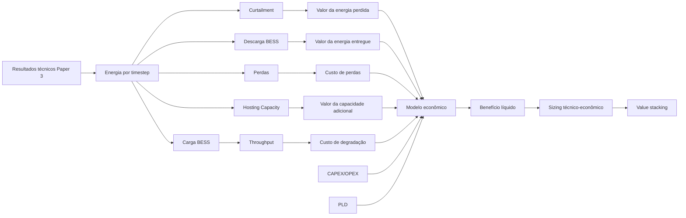
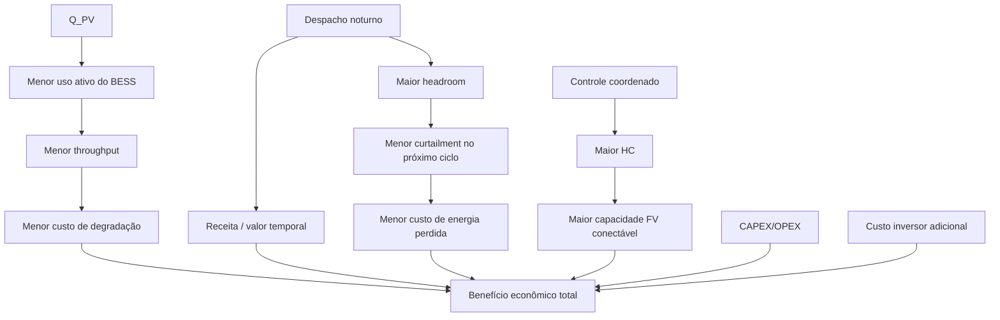
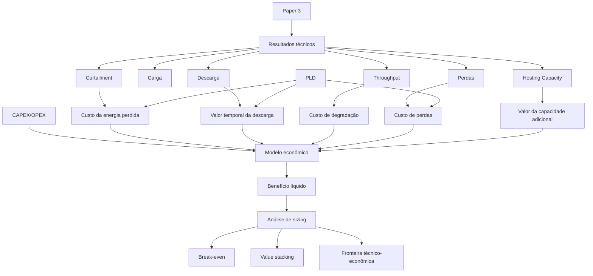

# Paper 4 — Mapa Conceitual e Roteiro Experimental Técnico-Econômico

## Título de trabalho

**Techno-Economic Assessment of Coordinated PV Inverter and Battery Flexibility in Active Distribution Networks**

Título alternativo, caso o foco final fique mais explícito em value stacking e Hosting Capacity:

**Techno-Economic Value Stacking of Reactive Support, Battery Dispatch and Curtailment Mitigation for Hosting Capacity Enhancement**

---

# 1. Posição do Paper 4 na linha de pesquisa

O Paper 4 deve ser construído **sobre os resultados técnicos consolidados do Paper 3**.

Ele não deve reabrir a comparação entre algoritmos de consenso.

Também não deve introduzir um novo controlador elétrico.

A arquitetura de controle chega ao Paper 4 já congelada:

\[
\boxed{
M^\star
+
Q_{PV}
+
P_{BESS,ch}
+
P_{BESS,dis}
+
Curtailment
}
\]

O Paper 4 acrescenta a camada econômica:

\[
\boxed{
PLD
+
valor\ da\ energia
+
custo\ de\ degradação
+
CAPEX/OPEX
+
sizing
+
value\ stacking
}
\]

A pergunta deixa de ser:

> Qual estratégia controla melhor a rede?

e passa a ser:

> **Qual é o valor econômico da flexibilidade técnica obtida nos Papers 2 e 3, e em quais condições o uso coordenado de BESS, suporte reativo e curtailment se torna tecnicamente e economicamente justificável?**

---

# 2. Pergunta científica central

> **Como o valor econômico da flexibilidade distribuída varia quando se consideram simultaneamente energia evitada de curtailment, arbitragem temporal, redução de pico, perdas, utilização do BESS, degradação e incremento de Hosting Capacity?**

O Paper 4 deve responder a essa pergunta sem transformar o estudo em um problema de otimização excessivamente complexo.

A primeira abordagem deve ser:

\[
\boxed{
\text{simulação técnica}
\rightarrow
\text{avaliação econômica ex post}
}
\]

Somente se os resultados justificarem, uma etapa futura pode transformar o problema em otimização econômica.

---

# 3. Hipóteses científicas

## H4.1 — Valor temporal da energia armazenada

> A energia absorvida pelo BESS durante períodos de excesso fotovoltaico possui valor econômico distinto conforme o instante em que é posteriormente descarregada.

Portanto:

\[
1\;kWh_{armazenado}
\]

não possui necessariamente o mesmo valor ao longo do dia.

A diferença depende de:

- PLD;
- horário de pico;
- valor técnico da redução de demanda;
- necessidade de recuperar headroom;
- perdas;
- degradação associada ao ciclo.

---

## H4.2 — Valor econômico indireto do suporte reativo

> O suporte reativo pode gerar benefício econômico indireto ao reduzir a necessidade de potência ativa do BESS, preservar capacidade energética e reduzir throughput e curtailment.

O valor econômico de \(Q\) não precisa vir de uma receita explícita.

Pode aparecer como:

\[
Q_{PV}
\rightarrow
E_{BESS,ch}\downarrow
\]

\[
E_{BESS,ch}\downarrow
\rightarrow
Throughput\downarrow
\]

\[
Throughput\downarrow
\rightarrow
C_{deg}\downarrow
\]

ou ainda:

\[
Q_{PV}
\rightarrow
Headroom\ preservado
\rightarrow
Curtailment\ evitado.
\]

---

## H4.3 — Curtailment mínimo não implica custo mínimo

> A estratégia que minimiza curtailment não necessariamente minimiza custo total quando a redução do corte exige aumento significativo do throughput e da degradação do BESS.

Pode ocorrer:

\[
E_{curt}\downarrow
\]

mas:

\[
E_{throughput}\uparrow
\]

e:

\[
C_{deg}\uparrow.
\]

Logo:

\[
\boxed{
\min(E_{curt})
\neq
\min(C_{total})
}
\]

em geral.

---

## H4.4 — Controle influencia sizing economicamente justificável

> A arquitetura operacional pode alterar a potência e a energia de BESS necessárias para atingir uma determinada meta de Hosting Capacity ou curtailment.

Assim, o valor econômico do controle não está apenas no OPEX.

Também pode aparecer como:

\[
\boxed{
CAPEX_{evitado}
}
\]

por redução do sizing necessário.

---

## H4.5 — Value stacking

> A combinação de serviços prestados pelo BESS pode aumentar significativamente o valor econômico do ativo em comparação com sua utilização exclusivamente para mitigação de sobretensão.

Serviços potenciais:

- absorção de excedente FV;
- redução de curtailment;
- descarga em horários de maior valor;
- peak shaving;
- suporte de tensão;
- redução de perdas;
- aumento de Hosting Capacity;
- postergação de reforços de rede.

---

## H4.6 — Hosting Capacity e valor econômico não são equivalentes

> A estratégia que maximiza Hosting Capacity não necessariamente maximiza benefício econômico líquido.

Por exemplo:

\[
HC\uparrow
\]

pode exigir:

\[
BESS\ maior
\]

ou:

\[
Throughput\ maior
\]

de modo que o benefício técnico adicional tenha custo econômico marginal elevado.

---

# 4. Objetivo geral

Quantificar o valor econômico dos recursos de flexibilidade estudados nos Papers 2 e 3, relacionando:

\[
\text{controle}
\rightarrow
\text{energia}
\rightarrow
\text{uso do BESS}
\rightarrow
\text{curtailment}
\rightarrow
\text{Hosting Capacity}
\rightarrow
\text{valor econômico}
\]

e identificar os trade-offs entre desempenho técnico, custo operacional e dimensionamento do armazenamento.

---

# 5. Objetivos específicos

1. Reutilizar diretamente os resultados temporais do Paper 3.
2. Integrar séries horárias de PLD.
3. Quantificar o valor da energia curtailed.
4. Quantificar o valor da energia descarregada.
5. Introduzir custo de perdas elétricas.
6. Introduzir custo simplificado de degradação por throughput.
7. Estimar Equivalent Full Cycles.
8. Comparar estratégias técnicas sob critério econômico.
9. Avaliar sensibilidade ao preço do BESS.
10. Avaliar sensibilidade ao custo de degradação.
11. Avaliar benefício econômico associado a aumento de Hosting Capacity.
12. Estudar sizing técnico-econômico.
13. Identificar o value stacking das diferentes funções.
14. Produzir métricas que permitam comparar:
    - economia anual;
    - custo evitado;
    - benefício líquido;
    - payback;
    - NPV, se o horizonte econômico for adotado.

---

# 6. Relação com o Paper 1

O Paper 1 já estabelece a base:

\[
E_{curt}(t)
\rightarrow
PLD(t)
\rightarrow
C_{curt}.
\]

O Paper 4 generaliza essa lógica.

O problema passa de:

\[
\boxed{
\text{valor da energia cortada}
}
\]

para:

\[
\boxed{
\text{valor total da flexibilidade}
}
\]

Incluindo:

\[
C_{curt}
\]

\[
R_{dis}
\]

\[
C_{deg}
\]

\[
C_{loss}
\]

\[
C_{BESS}
\]

e eventualmente:

\[
C_{reinforcement,avoided}.
\]

---

# 7. Referências necessárias e função no Paper 4

| Função no estudo | Referência / classe de referência | Papel |
|---|---|---|
| Curtailment + PLD | Paper 1 / metodologia já consolidada | base econômica já utilizada |
| Gestão econômica de storage | Byrne et al. (2018) | enquadramento de energy management |
| BESS e ancillary services | Alpízar-Castillo et al. (2023) | value stacking e serviços |
| Sizing / planejamento BESS | Xie et al. (2024) | relação entre armazenamento e absorção de PV |
| Hosting Capacity + BESS | estudos de HC com storage | valor técnico da expansão |
| Curtailment + BESS | Acosta-Campas et al. (2023) | energia evitada e atuação residual |
| Degradação simplificada | literatura de throughput / EFC | custo de uso do BESS |
| Degradação por SOC/ciclagem | Gantenbein et al. (2019) | efeito da ciclagem sobre vida útil |
| PLD | CCEE | série de preços |
| Custos de BESS | fontes técnicas/econômicas atualizadas | CAPEX/OPEX |
| Reforço de rede evitado | estudos de planejamento | comparação com infraestrutura convencional |

## Regra

Valores econômicos atualizáveis, como:

- CAPEX do BESS;
- OPEX;
- custo por kWh throughput;
- taxa de desconto;
- vida útil;
- PLD;

devem ser documentados por fonte e ano-base.

Nenhum valor deve ser adotado silenciosamente como universal.

---

# 8. Arquitetura do Paper 4

O motor elétrico permanece o mesmo do Paper 3.

O Paper 4 adiciona um módulo econômico:

```text
Resultados técnicos do Paper 3
        ↓
Séries temporais de energia
        ↓
PLD / custos / parâmetros econômicos
        ↓
Cálculo de receitas, custos e perdas
        ↓
Comparação por estratégia
        ↓
Análise de sensibilidade
        ↓
Sizing técnico-econômico
        ↓
Value stacking
```

---

# 9. Casos-base herdados do Paper 3

Manter os quatro casos fatoriais:

| Caso | \(Q\) | Dispatch |
|---|---:|---:|
| **T0** | Não | Não |
| **T1** | Sim | Não |
| **T2** | Não | Sim |
| **T3** | Sim | Sim |

No Paper 4, eles passam a ser avaliados economicamente.

Não alterar:

- rede;
- BESS;
- consenso;
- perfis;
- sizing;
- política de curtailment;
- lógica técnica.

---

# 10. Estrutura temporal dos dados econômicos

Para cada timestep:

\[
t
\]

devem existir pelo menos:

\[
E_{PV,disp}(t)
\]

\[
E_{PV,gen}(t)
\]

\[
E_{curt}(t)
\]

\[
E_{ch}(t)
\]

\[
E_{dis}(t)
\]

\[
E_{loss}(t)
\]

\[
P_{grid}(t)
\]

\[
SOC(t).
\]

E o preço:

\[
PLD(t).
\]

---

# 11. Conversão básica do PLD

Se:

\[
PLD(t)
\]

estiver em:

\[
R\$/MWh
\]

e a energia estiver em:

\[
kWh,
\]

usar:

\[
p(t)
=
\frac{PLD(t)}{1000}
\]

em:

\[
R\$/kWh.
\]

---

# 12. Custo econômico do curtailment

Para cada timestep:

\[
C_{curt}(t)
=
E_{curt}(t)p(t).
\]

Total:

\[
C_{curt,total}
=
\sum_t
E_{curt}(t)p(t).
\]

---

# 13. Valor da energia descarregada

A energia descarregada pelo BESS em determinado instante possui valor:

\[
R_{dis}(t)
=
E_{dis}(t)p(t).
\]

Total:

\[
R_{dis,total}
=
\sum_t
E_{dis}(t)p(t).
\]

## Atenção metodológica

Esse valor não deve ser chamado automaticamente de “lucro”.

Ele representa:

\[
\boxed{
\text{valor bruto da energia deslocada}
}
\]

antes de considerar:

- energia usada para carregar;
- perdas;
- degradação;
- custos fixos;
- CAPEX.

---

# 14. Valor da energia usada para carregar

Se a carga do BESS utiliza excedente que seria curtailed, seu custo de oportunidade pode ser tratado separadamente.

Definir:

\[
C_{ch,energy}(t)
=
E_{ch,grid}(t)p(t)
\]

para energia comprada da rede, se houver.

Se:

\[
E_{ch}
\]

vier exclusivamente de excedente FV que seria cortado, o custo marginal energético pode ser tratado como energia recuperada, mas isso deve ser declarado explicitamente.

---

# 15. Receita líquida simplificada da arbitragem

Uma primeira forma:

\[
R_{arb}
=
\sum_t
E_{dis}(t)p(t)
-
\sum_t
E_{ch,grid}(t)p(t).
\]

Se toda carga vier de FV excedente:

\[
E_{ch,grid}=0,
\]

então:

\[
R_{arb}
\approx
\sum_t
E_{dis}(t)p(t),
\]

mas ainda restam:

- perdas;
- degradação;
- CAPEX.

---

# 16. Valor do curtailment evitado

Escolhendo um caso-base \(B\) e um caso avaliado \(M\):

\[
V_{curt,avoided}^{M}
=
C_{curt}^{B}
-
C_{curt}^{M}.
\]

Se:

\[
V_{curt,avoided}>0,
\]

o caso \(M\) evitou perda econômica de energia FV.

---

# 17. Custo de perdas elétricas

Para cada passo:

\[
C_{loss}(t)
=
E_{loss}(t)p(t).
\]

Total:

\[
C_{loss,total}
=
\sum_t
E_{loss}(t)p(t).
\]

Benefício relativo:

\[
V_{loss,avoided}^{M}
=
C_{loss}^{B}
-
C_{loss}^{M}.
\]

---

# 18. Throughput do BESS

Definir:

\[
E_{throughput}
=
E_{ch}
+
E_{dis}.
\]

Ou, por unidade:

\[
E_{throughput,i}
=
\sum_t
\left[
E_{ch,i}(t)
+
E_{dis,i}(t)
\right].
\]

---

# 19. Equivalent Full Cycles

\[
EFC_i
=
\frac{
E_{throughput,i}
}{
2E_{usable,i}
}.
\]

Para o conjunto:

\[
EFC_{sys}
=
\frac{
\sum_iE_{throughput,i}
}{
2\sum_iE_{usable,i}
}.
\]

---

# 20. Custo simplificado de degradação por throughput

Primeira abordagem:

\[
C_{deg}
=
c_{deg}
E_{throughput}.
\]

onde:

\[
c_{deg}
\]

é dado em:

\[
R\$/kWh_{throughput}.
\]

Esse valor deve ser derivado de:

- custo do sistema;
- vida útil em ciclos;
- energia útil;
- DoD assumido.

---

# 21. Derivação simplificada de \(c_{deg}\)

Se:

\[
C_{rep}
\]

é o custo de reposição do BESS,

\[
N_{cycle}
\]

é a vida útil equivalente em ciclos,

e:

\[
E_{usable}
\]

é a energia utilizável,

a energia total processável aproximada é:

\[
E_{life}
=
2N_{cycle}E_{usable}.
\]

Então:

\[
c_{deg}
=
\frac{
C_{rep}
}{
E_{life}
}.
\]

Logo:

\[
C_{deg}
=
\frac{
C_{rep}
}{
2N_{cycle}E_{usable}
}
E_{throughput}.
\]

---

# 22. Limitações do modelo de degradação

Esse modelo:

- não representa temperatura;
- não representa calendário;
- não representa dependência de C-rate;
- não representa profundidade de descarga de forma detalhada;
- não usa Rainflow.

Portanto, no Paper 4 ele deve ser apresentado como:

\[
\boxed{
\text{modelo econômico simplificado de degradação por throughput}
}
\]

e não como modelo eletroquímico.

---

# 23. Sensibilidade de degradação

Testar:

\[
c_{deg}^{low}
\]

\[
c_{deg}^{base}
\]

\[
c_{deg}^{high}.
\]

Assim, a conclusão não depende de um único valor de degradação.

---

# 24. CAPEX do BESS

Para um sistema com:

\[
P_{BESS}
\]

e:

\[
E_{BESS},
\]

pode-se representar:

\[
CAPEX_{BESS}
=
c_P P_{BESS}
+
c_E E_{BESS}
+
C_{fixed}.
\]

onde:

- \(c_P\) = custo associado à potência;
- \(c_E\) = custo associado à energia;
- \(C_{fixed}\) = BOS, instalação, controle etc.

---

# 25. OPEX

Representação anual:

\[
OPEX_y
=
f_{O\&M}
CAPEX_{BESS}.
\]

ou diretamente:

\[
OPEX_y
=
C_{O\&M,y}.
\]

A forma utilizada deve depender da qualidade das fontes disponíveis.

---

# 26. Custo do inversor FV sobredimensionado

Se o Paper 3 adotar:

\[
S_{PV}>P_{mpp},
\]

o Paper 4 deve incorporar o custo adicional de capacidade aparente.

Definir:

\[
\Delta S_{PV}
=
S_{PV}
-
P_{mpp}.
\]

Custo incremental:

\[
C_{inv,extra}
=
c_S
\sum_i
\Delta S_{PV,i}.
\]

Isso é importante porque \(Q\) “gratuito” tecnicamente pode exigir sobredimensionamento de inversor.

---

# 27. Valor econômico indireto de \(Q\)

Comparar T0 × T1:

\[
\Delta C_{deg}^{Q}
=
C_{deg}^{T0}
-
C_{deg}^{T1}
\]

\[
\Delta C_{curt}^{Q}
=
C_{curt}^{T0}
-
C_{curt}^{T1}
\]

\[
\Delta C_{loss}^{Q}
=
C_{loss}^{T0}
-
C_{loss}^{T1}.
\]

O benefício técnico-econômico bruto de \(Q\) pode ser:

\[
B_Q
=
\Delta C_{deg}^{Q}
+
\Delta C_{curt}^{Q}
+
\Delta C_{loss}^{Q}.
\]

O benefício líquido deve descontar:

\[
C_{inv,extra}.
\]

---

# 28. Valor econômico do despacho

Comparar T0 × T2:

\[
B_D
=
R_{dis}^{T2}
+
V_{curt,avoided}^{T2}
+
V_{loss,avoided}^{T2}
-
C_{deg}^{T2}
-
C_{ch,energy}^{T2}.
\]

Essa expressão pode ser adaptada conforme a origem da energia usada no carregamento.

---

# 29. Valor combinado

Para T3:

\[
B_{QD}
=
R_{dis}^{T3}
+
V_{curt,avoided}^{T3}
+
V_{loss,avoided}^{T3}
-
C_{deg}^{T3}
-
C_{ch,energy}^{T3}
-
C_{inv,extra}.
\]

---

# 30. Interação econômica \(Q\times Dispatch\)

Definir:

\[
I_{econ}
=
(B_{T3}-B_{T2})
-
(B_{T1}-B_{T0}).
\]

Se:

\[
I_{econ}>0,
\]

há sinergia econômica positiva entre suporte reativo e despacho.

Se:

\[
I_{econ}<0,
\]

há redundância ou competição entre os recursos.

---

# 31. Value stacking

O benefício bruto anual pode ser decomposto em:

\[
B_{annual}
=
B_{curt}
+
B_{arb}
+
B_{peak}
+
B_{loss}
+
B_{HC}
+
B_{reinforcement}.
\]

Nem todos precisam ser monetizados no primeiro modelo.

A regra deve ser:

> monetizar apenas aquilo que possui fonte e interpretação econômica defensável.

---

# 32. Benefício de peak shaving

Se houver tarifa, demanda contratada ou valor de demanda de ponta disponível, pode-se calcular:

\[
B_{peak}
=
\Delta P_{peak}
\cdot
c_{demand}.
\]

Se não houver base tarifária adequada:

\[
\Delta P_{peak}
\]

permanece como métrica técnica e não é convertida em dinheiro.

---

# 33. Valor de Hosting Capacity

O Paper 4 deve separar duas perguntas:

1. quanto aumenta a HC?
2. quanto vale economicamente esse aumento?

Se:

\[
\Delta HC
=
HC_M
-
HC_B,
\]

pode-se calcular um indicador técnico-econômico:

\[
C_{flex/HC}
=
\frac{
C_{incremental}
}{
\Delta HC
}.
\]

Unidade:

\[
R\$/kW_{PV\ adicional}.
\]

---

# 34. Comparação com reforço convencional

Se houver dados defensáveis de custo de reforço:

\[
C_{reinforcement}
\]

e a estratégia de flexibilidade evitar ou postergar esse investimento:

\[
B_{deferral}
=
C_{reinforcement}
-
C_{flexibility}.
\]

Essa análise deve ser opcional.

Não introduzir valores de reforço sem fonte.

---

# 35. Sizing técnico-econômico

O Paper 4 deve reabrir o sizing, mas agora com finalidade econômica.

Definir uma grade:

\[
P_{BESS}
\in
\mathcal P
\]

e:

\[
E_{BESS}
\in
\mathcal E.
\]

Exemplo conceitual:

\[
r_P
=
\frac{
P_{BESS,total}
}{
P_{PV,total}
}
\]

e:

\[
H
=
\frac{
E_{BESS}
}{
P_{BESS}
}.
\]

---

# 36. Função de custo técnico-econômica por sizing

Para cada combinação:

\[
(P_{BESS},E_{BESS}),
\]

calcular:

\[
J
=
CAPEX_{ann}
+
OPEX
+
C_{deg}
+
C_{curt}
+
C_{loss}
-
R_{dis}
-
B_{other}.
\]

Essa função pode ser usada apenas como métrica de comparação.

Não é necessário transformar o experimento em um OPF.

---

# 37. Custo anualizado

Se o investimento for anualizado:

\[
CRF
=
\frac{
r(1+r)^n
}{
(1+r)^n-1
}
\]

onde:

- \(r\) = taxa de desconto;
- \(n\) = vida econômica.

Então:

\[
CAPEX_{ann}
=
CAPEX\cdot CRF.
\]

---

# 38. Custo total anual equivalente

\[
C_{annual}
=
CAPEX_{ann}
+
OPEX
+
C_{deg}
+
C_{curt}
+
C_{loss}
-
R_{dis}
-
B_{peak}
-
B_{HC}.
\]

Nem todos os termos precisam ser ativados ao mesmo tempo.

O modelo deve permitir ligar/desligar componentes.

---

# 39. NPV

Se houver horizonte de vários anos:

\[
NPV
=
-C_0
+
\sum_{y=1}^{N}
\frac{
B_y-C_y
}{
(1+r)^y
}.
\]

Esse indicador só deve entrar se:

- CAPEX estiver bem fundamentado;
- vida útil estiver definida;
- degradação e reposição estiverem tratadas;
- a série econômica for coerente.

Caso contrário, usar comparação anual equivalente.

---

# 40. Payback simples

\[
Payback
=
\frac{
CAPEX
}{
B_{annual,net}
}.
\]

Usar apenas como indicador complementar.

Não deve ser a métrica econômica principal.

---

# 41. LCOS opcional

Se houver interesse em custo de armazenamento:

\[
LCOS
=
\frac{
PV(CAPEX+OPEX+replacement+charging)
}{
PV(E_{discharged})
}.
\]

Essa métrica é útil, mas não deve substituir o objetivo principal do paper.

---

# 42. Métrica de valor por Hosting Capacity adicional

\[
V_{HC}
=
\frac{
B_{annual,net}
}{
\Delta HC
}.
\]

Alternativamente:

\[
C_{HC}
=
\frac{
C_{annual}
}{
HC
}.
\]

Essas métricas permitem conectar diretamente economia e capacidade de hospedagem.

---

# 43. Horizonte econômico

O estudo pode ser dividido em duas camadas.

## Camada A — diária

Usa exatamente os resultados do Paper 3:

\[
48h.
\]

Objetivo:

- validar cálculos;
- mostrar causalidade.

## Camada B — anualizada

Escalar ou repetir cenários representativos.

Preferência:

- múltiplos dias representativos;
- ou dados anuais, se disponíveis.

Não extrapolar um único dia para um ano sem declarar a limitação.

---

# 44. Dias representativos

Se mantivermos continuidade com o Paper 1, podem ser reutilizados os dias já trabalhados:

- 25/01/2022;
- 05/08/2022;
- 08/08/2022;
- 18/11/2022.

Cada dia possui:

- curva FV;
- perfil de carga;
- PLD.

Isso cria uma ponte direta entre Paper 1 e Paper 4.

---

# 45. Estratégia de anualização

Uma possibilidade:

\[
C_{annual}
=
\sum_d
w_d
C_d
\]

onde:

\[
w_d
\]

é o peso representativo de cada classe de dia.

Se não houver base estatística suficiente para definir \(w_d\), não usar anualização ponderada como resultado principal.

Nesse caso, apresentar:

\[
\boxed{
\text{comparação multi-dia}
}
\]

em vez de “resultado anual”.

---

# 46. Matriz de cenários econômicos

## Bloco A — estratégias operacionais

\[
T0,T1,T2,T3.
\]

## Bloco B — sizing

Para cada estratégia:

\[
P_{BESS}\times E_{BESS}.
\]

## Bloco C — custos

Três cenários:

- baixo;
- base;
- alto.

Para:

\[
CAPEX
\]

e:

\[
c_{deg}.
\]

## Bloco D — preço de energia

Usar dias/PLDs reais.

## Bloco E — Hosting Capacity

Comparar custo incremental por kW FV adicional hospedado.

---

# 47. Estrutura mínima da análise de sensibilidade

Variar pelo menos:

\[
CAPEX_{BESS}
\]

\[
c_{deg}
\]

\[
PLD
\]

\[
\eta_c,\eta_d
\]

\[
P_{BESS}
\]

\[
E_{BESS}.
\]

Opcionalmente:

\[
\kappa_S
\]

do inversor FV.

---

# 48. Tornado chart

Para uma métrica econômica:

\[
B_{net}
\]

pode-se calcular a sensibilidade de cada parâmetro.

Exemplo:

```text
CAPEX BESS        |████████████████|
degradação        |██████████      |
PLD               |████████        |
eficiência        |████            |
OPEX              |███             |
```

Esse tipo de gráfico ajuda a mostrar quais hipóteses econômicas realmente dominam o resultado.

---

# 49. Break-even

Calcular valores de equilíbrio.

## Custo máximo do BESS

Encontrar:

\[
CAPEX_{break-even}
\]

tal que:

\[
NPV=0
\]

ou:

\[
B_{annual}=C_{annual}.
\]

## Custo máximo de degradação

\[
c_{deg}^{break-even}.
\]

## Spread mínimo de preço

Para arbitragem:

\[
\Delta p_{min}
\]

necessário para compensar perdas e degradação.

---

# 50. Spread econômico mínimo da arbitragem

Para eficiência round-trip:

\[
\eta_{rt}
=
\eta_c\eta_d,
\]

uma condição simplificada é:

\[
p_{sell}
>
\frac{
p_{buy}
}{
\eta_{rt}
}
+
c_{deg,eq}.
\]

Esse resultado pode ajudar a explicar quando a descarga economicamente motivada faz sentido.

---

# 51. Valor indireto do headroom

O headroom recuperado à noite pode ter valor econômico se evitar curtailment no dia seguinte.

Definir:

\[
V_{headroom}
=
C_{curt,without\ dispatch}
-
C_{curt,with\ dispatch}.
\]

Isso é particularmente importante porque a descarga pode ser valiosa mesmo sem arbitragem forte de PLD.

---

# 52. Valor econômico de evitar saturação

Se a descarga impede:

\[
SOC=SOC_{max}
\]

durante o segundo dia e evita:

\[
E_{curt},
\]

o benefício deve ser atribuído ao despacho intertemporal.

Essa relação deve ser mostrada explicitamente:

\[
Dispatch
\rightarrow
SOC_{sunrise}\downarrow
\rightarrow
Headroom\uparrow
\rightarrow
Curtailment\downarrow
\rightarrow
C_{curt}\downarrow.
\]

---

# 53. Diagrama conceitual econômico



---

# 54. Cadeia causal do Paper 4



---

# 55. Função econômica consolidada

Uma formulação geral:

\[
J
=
CAPEX_{ann}
+
OPEX
+
C_{deg}
+
C_{curt}
+
C_{loss}
+
C_{energy,ch}
+
C_{inv,extra}
-
R_{dis}
-
B_{peak}
-
B_{HC}
-
B_{deferral}.
\]

Quanto menor:

\[
J,
\]

melhor economicamente.

Mas o paper não deve reduzir toda a discussão a um único escalar.

É importante mostrar os componentes separadamente.

---

# 56. Decomposição econômica obrigatória

Para cada caso:

```text
CAPEX anualizado
OPEX
curtailment
perdas
degradação
energia de carga
valor da descarga
peak shaving
benefício de HC
benefício de reforço evitado
resultado líquido
```

Assim fica claro **de onde vem o resultado**.

---

# 57. Resultados esperados

O estudo não deve antecipar que T3 será sempre economicamente superior.

Resultados plausíveis a investigar:

### Caso 1

\[
Q
\]

reduz throughput e degradação, mas exige inversor maior.

### Caso 2

Despacho reduz curtailment no dia seguinte, mas o spread de PLD não paga a degradação.

### Caso 3

T3 tem maior benefício técnico, mas CAPEX adicional torna T2 economicamente mais atrativo.

### Caso 4

Sizing menor com controle melhor produz melhor resultado que sizing maior com controle simples.

### Caso 5

HC aumenta muito, mas custo marginal por kW adicional cresce rapidamente.

Todos são resultados cientificamente válidos.

---

# 58. Métricas econômicas principais

## Energia perdida

\[
C_{curt}.
\]

## Valor da descarga

\[
R_{dis}.
\]

## Degradação

\[
C_{deg}.
\]

## Perdas

\[
C_{loss}.
\]

## Benefício líquido

\[
B_{net}.
\]

## Custo anual equivalente

\[
C_{annual}.
\]

## Break-even

\[
CAPEX_{break-even}.
\]

## Custo por HC adicional

\[
C_{flex/HC}.
\]

---

# 59. Métricas de investimento opcionais

Se os dados forem robustos:

\[
NPV
\]

\[
Payback
\]

\[
LCOS
\]

\[
IRR.
\]

Essas métricas só devem ser usadas se o horizonte financeiro estiver suficientemente fundamentado.

---

# 60. Resultados técnicos que devem acompanhar os econômicos

Mesmo no Paper 4, apresentar:

\[
HC
\]

\[
Curt\%
\]

\[
E_{throughput}
\]

\[
EFC
\]

\[
\Delta P_{peak}
\]

\[
E_{loss}.
\]

Isso evita que a análise econômica fique desconectada do comportamento físico.

---

# 61. Estrutura de resultados do executor

```text
Resultados_Paper4/
├── config_economic.yaml
├── manifest.json
├── technical_input/
│   ├── timestep.csv
│   ├── bess.csv
│   ├── pv.csv
│   └── hosting_capacity.csv
├── prices/
│   └── pld.csv
├── economic/
│   ├── cashflow_timestep.csv
│   ├── strategy_summary.csv
│   ├── sizing_summary.csv
│   ├── degradation.csv
│   ├── sensitivity.csv
│   └── break_even.csv
├── figures/
└── tables/
```

---

# 62. Campos mínimos do cashflow por timestep

```text
case
day
hour
PLD_R_MWh
price_R_kWh
E_pv_available_kWh
E_pv_generated_kWh
E_curt_kWh
E_charge_kWh
E_discharge_kWh
E_loss_kWh
throughput_kWh
cost_curt_R
revenue_discharge_R
cost_losses_R
cost_degradation_R
net_timestep_R
```

---

# 63. Campos mínimos por cenário

```text
case
P_BESS_kW
E_BESS_kWh
HC_kW
Curtailment_kWh
Curtailment_R
Charge_kWh
Discharge_kWh
Throughput_kWh
EFC
Losses_kWh
Losses_R
Degradation_R
Revenue_discharge_R
CAPEX_R
Annualized_CAPEX_R
OPEX_R
Net_annual_R
Cost_per_HC_R_kW
```

---

# 64. Figuras previstas

## Figura 1 — Arquitetura técnico-econômica

Controle técnico → fluxos energéticos → componentes econômicos.

## Figura 2 — PLD e carga/descarga

Mostrar relação temporal entre:

\[
PLD(t)
\]

\[
P_{ch}(t)
\]

\[
P_{dis}(t).
\]

## Figura 3 — Custo do curtailment por caso

## Figura 4 — Throughput e custo de degradação

## Figura 5 — Decomposição do benefício

Waterfall chart conceitual:

```text
Curtailment evitado
+ valor descarga
+ perdas evitadas
- degradação
- CAPEX
- OPEX
= benefício líquido
```

## Figura 6 — Benefício líquido T0–T3

## Figura 7 — Sizing \(P/E\) × custo

Mapa de calor.

## Figura 8 — Sizing \(P/E\) × HC

Mapa de calor.

## Figura 9 — Fronteira técnico-econômica

\[
HC
\]

versus:

\[
C_{annual}.
\]

## Figura 10 — Tornado chart

## Figura 11 — Break-even CAPEX

## Figura 12 — Custo por kW adicional de HC

---

# 65. Tabelas previstas

## Tabela I — parâmetros econômicos

- PLD;
- CAPEX;
- OPEX;
- vida útil;
- ciclos;
- taxa de desconto;
- eficiência;
- custo de inversor adicional.

## Tabela II — resultados técnicos herdados do Paper 3

## Tabela III — decomposição econômica T0–T3

## Tabela IV — análise de sizing

## Tabela V — sensibilidade

## Tabela VI — break-even

---

# 66. Sizing técnico-econômico

O Paper 2 escolhe sizing experimental.

O Paper 3 mantém esse sizing para clareza causal.

O Paper 4 reabre o sizing.

A matriz pode ser:

\[
r_P
\in
\{r_{P,1},r_{P,2},...,r_{P,m}\}
\]

e:

\[
H
\in
\{H_1,H_2,...,H_n\}.
\]

Para cada combinação:

\[
P_{BESS,total}
=
r_P P_{PV,total}
\]

\[
E_{BESS,total}
=
H P_{BESS,total}.
\]

---

# 67. Mapa de calor técnico-econômico

Para cada:

\[
(r_P,H),
\]

calcular:

\[
HC
\]

\[
Curt\%
\]

\[
C_{annual}
\]

\[
B_{net}.
\]

Assim podemos construir:

```text
            H = 1h    2h    4h    6h
rP = 0.1      ...
rP = 0.2      ...
rP = 0.3      ...
rP = 0.4      ...
```

---

# 68. Fronteira de Pareto técnico-econômica

Mesmo sem usar otimização formal, pode-se identificar soluções não dominadas entre:

\[
\max(HC)
\]

e:

\[
\min(C_{annual}).
\]

Uma solução é dominada se outra possui simultaneamente:

- maior ou igual HC;
- menor ou igual custo.

O conjunto não dominado forma uma fronteira técnica-econômica.

---

# 69. Value stacking por serviço

Decompor o valor do BESS:

\[
V_{BESS}
=
V_{curt}
+
V_{arb}
+
V_{peak}
+
V_{loss}
+
V_{HC}
+
V_{deferral}.
\]

E comparar com:

\[
C_{BESS}
=
CAPEX_{ann}
+
OPEX
+
C_{deg}.
\]

---

# 70. Índice de utilização econômica do ativo

Pode-se definir:

\[
VUR
=
\frac{
V_{BESS}
}{
CAPEX_{ann}+OPEX+C_{deg}
}.
\]

Interpretação:

- \(VUR>1\): valor anual estimado maior que custo anual equivalente;
- \(VUR<1\): valor anual estimado menor.

Esse índice é opcional e deve ser claramente definido se utilizado.

---

# 71. Análise de sensibilidade mínima

Rodar cenários:

## CAPEX

\[
-30\%,\quad base,\quad +30\%.
\]

## Degradação

\[
low,\quad base,\quad high.
\]

## PLD

usar os diferentes dias reais.

## Vida útil

cenários conservador/base/otimista.

## Taxa de desconto

faixa coerente com o estudo.

Não utilizar valores sem fonte.

---

# 72. Checks econômicos

## Unidade do PLD

\[
R\$/MWh
\rightarrow
R\$/kWh.
\]

## Energia

Todos os custos devem usar:

\[
kWh
\]

ou:

\[
MWh
\]

consistentemente.

## Receita

Não contar duas vezes:

- energia evitada de curtailment;
- energia descarregada;
- benefício de HC.

Cada componente deve ter interpretação econômica independente.

## Degradação

Não contabilizar simultaneamente:

- custo por throughput;
- custo por EFC;

como dois custos separados.

São duas formas de representar o mesmo fenômeno.

---

# 73. Prevenção de double counting

Exemplo de erro:

\[
E_{curt,avoided}
\]

é armazenada e depois descarregada.

Não se deve necessariamente contar:

\[
100\% \text{ do valor da energia evitada}
\]

mais:

\[
100\% \text{ da receita de venda}
\]

sem verificar a interpretação econômica.

O fluxo financeiro precisa indicar claramente:

1. origem da energia;
2. custo de oportunidade;
3. destino;
4. receita final.

---

# 74. Auditoria de balanço financeiro

Para cada timestep:

\[
Net(t)
=
Revenue(t)
-
Cost(t).
\]

E:

\[
Net_{total}
=
\sum_tNet(t).
\]

O resumo deve reconciliar exatamente com os componentes detalhados.

---

# 75. Ordem de implementação

1. congelar os resultados técnicos finais do Paper 3;
2. criar formato comum de exportação;
3. importar PLD;
4. reproduzir exatamente o cálculo econômico do Paper 1;
5. calcular custo do curtailment;
6. adicionar valor da descarga;
7. adicionar perdas;
8. adicionar throughput;
9. implementar custo simplificado de degradação;
10. validar ausência de double counting;
11. incluir CAPEX/OPEX;
12. criar comparação T0–T3;
13. implementar sizing \(P/E\);
14. executar análise de sensibilidade;
15. calcular break-even;
16. avaliar HC por custo;
17. somente depois considerar NPV/Payback/LCOS.

---

# 76. Núcleo causal do Paper 4

O Paper 4 deve poder ser resumido assim:

\[
\boxed{
\text{mesmo sistema técnico do Paper 3}
}
\]

produz:

\[
\{
Curtailment,
Charge,
Discharge,
Throughput,
Losses,
HC
\}
\]

que são convertidos em:

\[
\{
C_{curt},
R_{dis},
C_{deg},
C_{loss},
B_{HC}
\}
\]

e combinados com:

\[
\{
CAPEX,
OPEX
\}
\]

para obter:

\[
\boxed{
\text{valor técnico-econômico da flexibilidade}
}
\]

---

# 77. Mapa conceitual resumido



---

# 78. Contribuição científica pretendida

A contribuição do Paper 4 não deve ser apenas:

> “calcular o custo do BESS”.

Também não deve ser apenas:

> “multiplicar curtailment por PLD”.

A contribuição pretendida é:

> **quantificar como as decisões técnicas de coordenação, suporte reativo e despacho temporal modificam o valor econômico do armazenamento distribuído, considerando simultaneamente curtailment evitado, energia deslocada, degradação, perdas, sizing e Hosting Capacity.**

O diferencial é construir a cadeia:

\[
\boxed{
controle
\rightarrow
uso físico do ativo
\rightarrow
fluxo energético
\rightarrow
custo/degradação
\rightarrow
valor econômico
}
\]

sem desconectar a análise econômica da física da rede.

---

# 79. Resultado final esperado da linha Paper 1 → Paper 4

## Paper 1

\[
\text{Consenso}
\rightarrow
Curtailment
\rightarrow
PLD
\]

## Paper 2

\[
\text{Consenso}
\rightarrow
BESS
\rightarrow
SOC/Saturação
\rightarrow
Curtailment
\rightarrow
HC
\]

## Paper 3

\[
Q
+
BESS_{charge/discharge}
+
Curtailment
\rightarrow
desempenho técnico
\]

## Paper 4

\[
\text{desempenho técnico}
+
PLD
+
degradação
+
CAPEX/OPEX
+
sizing
\rightarrow
\boxed{\text{valor econômico da flexibilidade}}
\]

---

# 80. Próxima ação prática após o Paper 3

Quando o Paper 3 estiver concluído:

1. congelar T0–T3;
2. exportar séries energéticas completas;
3. reutilizar o pipeline PLD do Paper 1;
4. validar custo de curtailment;
5. acrescentar valor de descarga;
6. acrescentar perdas;
7. acrescentar throughput/degradação;
8. criar modelo econômico modular;
9. somente depois reabrir sizing e CAPEX.

Esse deve ser o caminho operacional do Paper 4.
